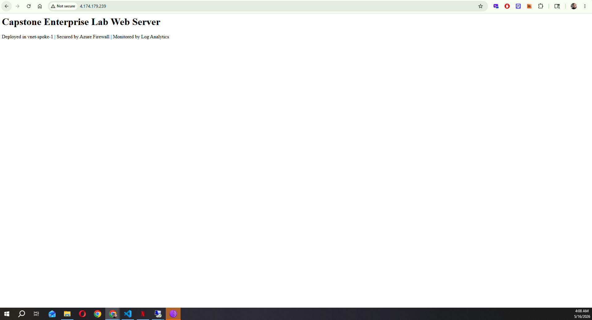
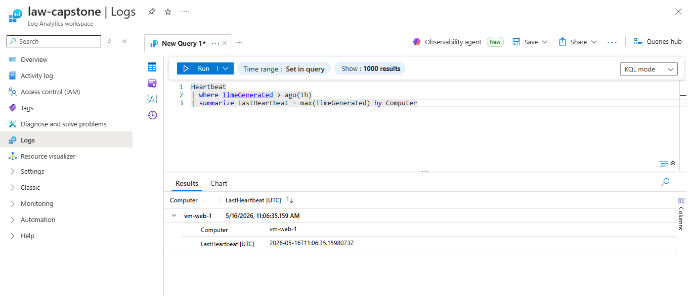

# Enterprise Hybrid Cloud Capstone

## Overview

This capstone project brings together every skill from the 12-project 
series into a single, cohesive enterprise environment. It represents 
what a real hybrid cloud infrastructure looks like — secure, monitored, 
automated, and documented.

Everything here was built from scratch: the networking foundation 
deployed as code via Terraform, identity managed through Active 
Directory, workloads protected behind a firewall and load balancer, 
and the entire environment verified through automated security auditing.

## Architecture


```
┌─────────────────────────────────────────────────────────────────┐
│                     Microsoft Azure — Canada Central             │
│                                                                   │
│  ┌─────────────────────────────────────────────────────────┐    │
│  │  Hub VNet (10.0.0.0/16) — Deployed via Terraform         │    │
│  │                                                           │    │
│  │  ┌──────────────┐  ┌──────────────┐  ┌───────────────┐  │    │
│  │  │   vm-dc      │  │ Azure        │  │  Private DNS  │  │    │
│  │  │ AD DS + DNS  │  │ Firewall     │  │ shaheerlab    │  │    │
│  │  │ 10.0.3.4     │  │ fw-hub       │  │ .com internal │  │    │
│  │  └──────────────┘  └──────────────┘  └───────────────┘  │    │
│  └─────────────────────────────────────────────────────────┘    │
│                           │ VNet Peering                          │
│            ┌──────────────┴──────────────┐                       │
│            │                             │                        │
│  ┌─────────────────┐         ┌─────────────────┐                 │
│  │ vnet-spoke-1    │         │ vnet-spoke-2    │                 │
│  │ 10.1.0.0/16     │         │ 10.2.0.0/16     │                 │
│  │                 │         │                 │                  │
│  │ vm-web-1        │         │ (workload ready)│                 │
│  │ nginx + LB      │         │                 │                 │
│  └─────────────────┘         └─────────────────┘                 │
│                                                                   │
│  ┌─────────────────────────────────────────────────────────┐    │
│  │  law-capstone — Log Analytics + KQL + Alerts             │    │
│  └─────────────────────────────────────────────────────────┘    │
└─────────────────────────────────────────────────────────────────┘
```

## What's running

| Component | Resource | Details |
|-----------|----------|---------|
| Core networking | vnet-hub, vnet-spoke-1, vnet-spoke-2 | Deployed via Terraform |
| Identity | vm-dc | Active Directory — shaheerlab.local |
| Web tier | vm-web-1 + lb-capstone | nginx behind Standard Load Balancer |
| Security | Azure Firewall | Inspecting all spoke outbound traffic |
| DNS | internal.shaheerlab.com | Private zone linked to all VNets |
| Monitoring | law-capstone | Log Analytics with KQL queries and alerts |
| Automation | Terraform | 24 resources deployed as code |
| Security audit | PowerShell script | Automated misconfiguration scanning |

## How it was built

### Phase 1 — Infrastructure as Code
The entire networking foundation was deployed with a single 
`terraform apply` command — resource group, 3 VNets, 6 subnets, 
4 VNet peerings, 2 NSGs, private DNS zone with 3 VNet links, and 
a Log Analytics workspace. 24 resources, zero portal clicking.

### Phase 2 — Security Layer
Azure Firewall deployed in the hub VNet with a dedicated 
AzureFirewallSubnet. Route tables force all spoke outbound traffic 
through the firewall. Network rules allow DNS and NTP. Application 
rules allow only specific FQDNs — *.microsoft.com, *.azure.com. 
Everything else is denied by default.

### Phase 3 — Identity
Windows Server 2022 domain controller deployed in SharedServicesSubnet. 
Active Directory domain `shaheerlab.local` created with organisational 
units, user accounts (jsmith, domainadmin), and security groups 
(IT-Staff). DNS forwarder set to Azure's internal resolver 
(168.63.129.16) for seamless internal and external resolution.

### Phase 4 — Workloads
nginx web server deployed in vnet-spoke-1 behind an Azure Standard 
Load Balancer. Health probes verify availability every 5 seconds. 
NSG rules allow HTTP from the internet and SSH only from the hub network.

### Phase 5 — Monitoring
Log Analytics workspace connected to vm-web-1 via Data Collection Rule. 
Heartbeat data confirming VM availability. Syslog events flowing in 
real time. KQL queries built for CPU performance, memory, and event 
analysis.

### Phase 6 — Security Verification
Automated PowerShell audit script scanned the entire subscription. 
Found 2 real findings — unprotected subnets. Fixed both by associating 
NSGs. Re-ran audit confirming clean status. Full audit trail documented.

## Terraform state


24 resources managed by Terraform:
- Resource group
- 3 Virtual Networks
- 6 Subnets
- 4 VNet peerings
- 2 NSGs + 3 subnet associations
- Private DNS zone + 3 VNet links
- Log Analytics workspace

## Active Directory


```
Domain:      shaheerlab.local
Forest:      shaheerlab.local
DC:          vm-dc.shaheerlab.local
OU:          LabUsers
Users:       jsmith, domainadmin
Groups:      IT-Staff, Domain Admins
```

## Load Balancer




Standard Load Balancer serving traffic to vm-web-1 nginx.
Health probe at 100% — backend confirmed healthy.
Custom page served confirming end-to-end connectivity.

## Monitoring




Log Analytics workspace collecting heartbeat and syslog data 
from vm-web-1. KQL queries confirming VM is alive and events 
are flowing. Alert rule configured to fire if heartbeat is lost.

## Security Audit


Automated PowerShell script scanned entire subscription:
- Run 1: Found 2 findings — unprotected subnets
- Remediation: Associated NSGs to both subnets
- Run 2: Clean — zero findings

## Skills demonstrated

| Skill | Where used |
|-------|-----------|
| Azure networking | Hub-and-spoke, VNet peering, NSGs |
| Infrastructure as Code | Terraform — 24 resources |
| Active Directory | Domain controller, users, groups, DNS |
| Network security | Azure Firewall, forced tunneling, NSGs |
| Load balancing | Standard LB, health probes, backend pools |
| Monitoring | Log Analytics, KQL, DCR, alerts |
| Security automation | PowerShell audit script |
| Troubleshooting | Asymmetric routing, quota limits, DNS |

## What I learned from the capstone

**IaC first is the right approach.** Deploying the foundation via 
Terraform meant the networking was consistent, repeatable, and 
version controlled from the start. When something needed changing 
it was one line of code not 10 portal clicks.

**Asymmetric routing is a real problem.** The load balancer worked 
perfectly — health probes passing, backend healthy — but traffic 
wasn't flowing because the route table was forcing return traffic 
through the firewall which dropped it. Understanding the full traffic 
path in both directions is essential for troubleshooting.

**Free trial quotas require creative problem solving.** Hit vCPU 
limits, public IP limits, and VM family restrictions throughout the 
capstone. Each constraint required a different workaround — resizing 
VMs, choosing different families, prioritizing which resources matter 
most. Real cloud engineering always involves working within constraints.

**Security is never done.** Even in a carefully designed environment 
the automated audit found real unprotected subnets. In production 
these would be caught by Defender for Cloud and remediated 
automatically. Building the habit of scanning and fixing is more 
important than thinking you're already secure.

**DNS is always the first thing to check.** Every time something 
didn't work during this project — connectivity issues, domain join 
failures, package installation errors — DNS was involved. It's the 
foundation everything else depends on.

## Resources deployed

| Resource | Type | Purpose |
|----------|------|---------|
| rg-capstone | Resource Group | Container for all capstone resources |
| vnet-hub | Virtual Network | Hub — shared services |
| vnet-spoke-1 | Virtual Network | Web tier workloads |
| vnet-spoke-2 | Virtual Network | Application tier workloads |
| GatewaySubnet | Subnet | Reserved for VPN Gateway |
| AzureFirewallSubnet | Subnet | Azure Firewall |
| SharedServicesSubnet | Subnet | AD, DNS, management |
| snet-workload-a | Subnet | Web VMs |
| snet-workload-b | Subnet | App VMs |
| nsg-shared | NSG | Hub subnet protection |
| nsg-workload | NSG | Spoke subnet protection |
| fw-hub | Azure Firewall | Outbound traffic inspection |
| policy-capstone | Firewall Policy | Network and app rules |
| lb-capstone | Load Balancer | Web tier HA |
| pip-lb-capstone | Public IP | Load balancer frontend |
| vm-dc | Virtual Machine | Domain controller |
| vm-web-1 | Virtual Machine | nginx web server |
| internal.shaheerlab.com | Private DNS Zone | Internal name resolution |
| law-capstone | Log Analytics | Centralized monitoring |
| dcr-capstone | Data Collection Rule | VM telemetry |

## Cost
~CA$15 — Windows Server D2s_v3 domain controller, B2ats web VM, 
Standard Load Balancer, Azure Firewall (deleted after verification), 
and Log Analytics ingestion running for several hours.
Total project series cost: ~CA$45 across all 12 projects + capstone.
