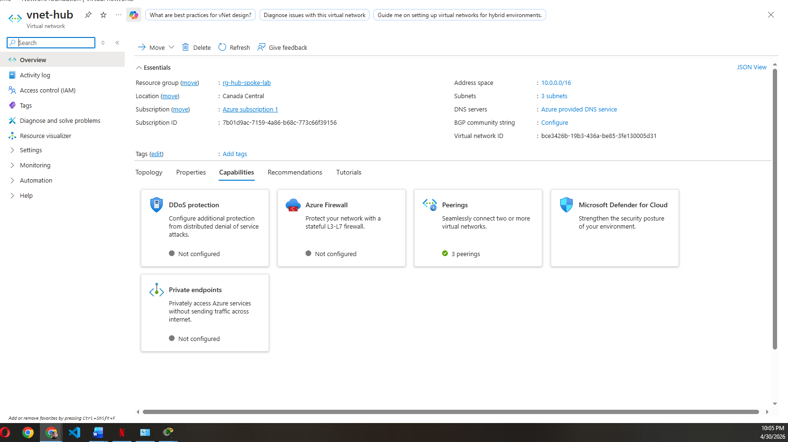
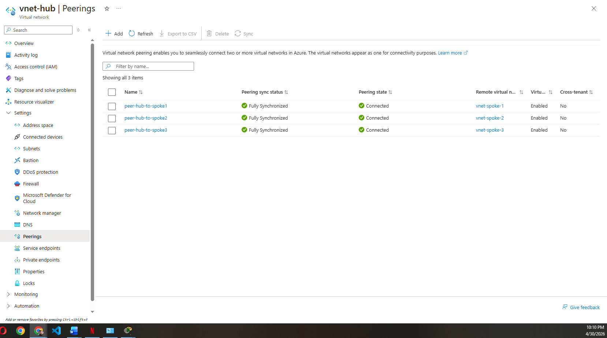
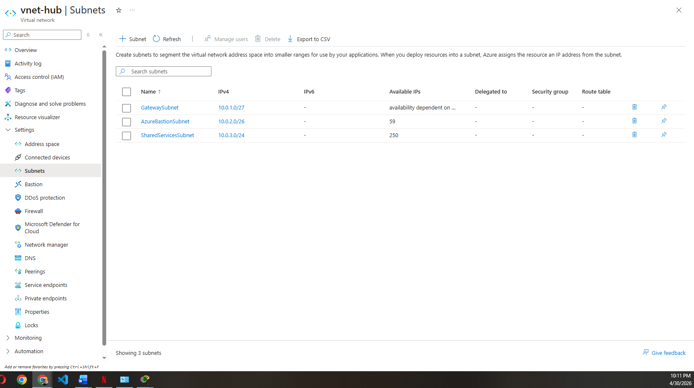
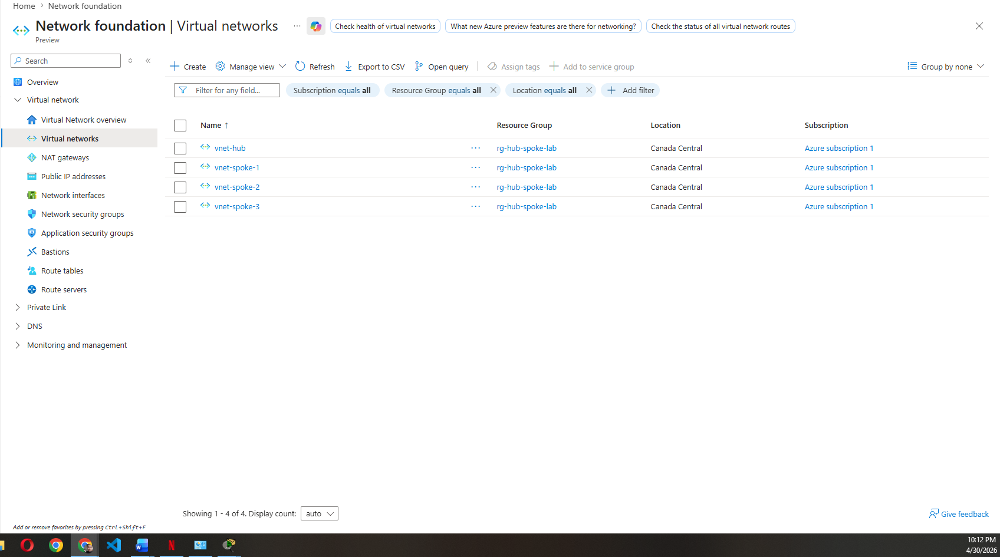

# Project 01 — Hub-and-Spoke VNet Topology

## Overview
Deployed a hub-and-spoke Virtual Network topology in Microsoft Azure 
simulating an enterprise network architecture where all spoke networks 
connect through a central hub containing shared services.

## Architecture Diagram

Hub VNet (10.0.0.0/16)
├── GatewaySubnet (10.0.1.0/27) — reserved for VPN Gateway
├── AzureBastionSubnet (10.0.2.0/26) — secure VM access
└── SharedServicesSubnet (10.0.3.0/24) — DNS, management

Spoke 1 VNet (10.1.0.0/16) ←→ Hub (peered)
Spoke 2 VNet (10.2.0.0/16) ←→ Hub (peered)
Spoke 3 VNet (10.3.0.0/16) ←→ Hub (peered)

## What I Built
- 1 Hub VNet with 3 subnets for shared infrastructure
- 3 Spoke VNets each with a dedicated workload subnet
- Bidirectional VNet peering between hub and all 3 spokes
- Gateway transit enabled on hub peerings for future VPN Gateway
- Verified end-to-end traffic flow between hub and spoke VMs

## IP Addressing

| VNet | Address Space | Purpose |
|------|--------------|---------|
| vnet-hub | 10.0.0.0/16 | Shared services, gateway, bastion |
| vnet-spoke-1 | 10.1.0.0/16 | Workload A |
| vnet-spoke-2 | 10.2.0.0/16 | Workload B |
| vnet-spoke-3 | 10.3.0.0/16 | Workload C |

| Subnet | Range | Purpose |
|--------|-------|---------|
| GatewaySubnet | 10.0.1.0/27 | Future VPN Gateway |
| AzureBastionSubnet | 10.0.2.0/26 | Azure Bastion host |
| SharedServicesSubnet | 10.0.3.0/24 | DNS, management VMs |
| snet-workload-a | 10.1.1.0/24 | Spoke 1 workloads |
| snet-workload-b | 10.2.1.0/24 | Spoke 2 workloads |
| snet-workload-c | 10.3.1.0/24 | Spoke 3 workloads |

## Peering Configuration

| Peering | Direction | Gateway Transit | Status |
|---------|-----------|----------------|--------|
| peer-hub-to-spoke1 | Hub → Spoke 1 | Enabled | Connected |
| peer-hub-to-spoke2 | Hub → Spoke 2 | Enabled | Connected |
| peer-hub-to-spoke3 | Hub → Spoke 3 | Enabled | Connected |

## Key Concepts Learned
- Hub-and-spoke is the standard enterprise Azure network topology
- VNet peering is private, high-speed, and never touches the public internet
- Peering is non-transitive — spokes cannot communicate directly, 
  all traffic routes through the hub
- GatewaySubnet must be named exactly that for VPN Gateway attachment
- AzureBastionSubnet must be named exactly that for Bastion deployment
- Gateway transit allows all spokes to share one VPN Gateway in the hub
- All VNet address spaces must be non-overlapping for peering to work

## Verification
- All 3 peerings show Connected and Synchronized status ✅
- Deployed test VMs in hub and spoke, confirmed ping replies ✅
- Traffic flows privately through Azure backbone, no public internet ✅

## Screenshots

## Tools Used
- Microsoft Azure Portal
- Azure Virtual Networks
- Azure Bastion
- Ubuntu Server 24.04 LTS (test VMs)

## Cost
~CA$6 (Bastion running overnight — lesson learned: 
delete Bastion after each session)
