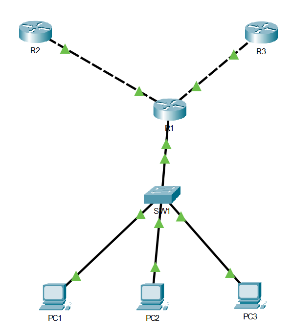
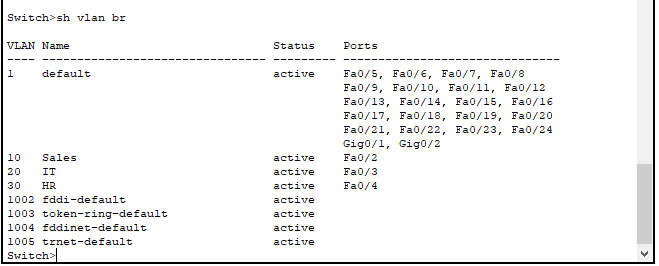
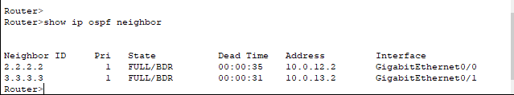
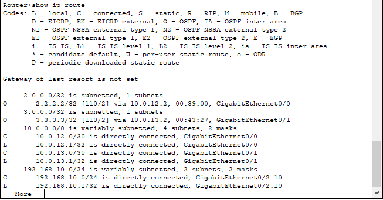
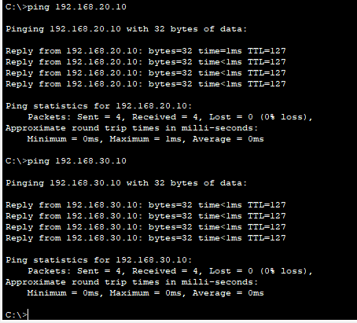
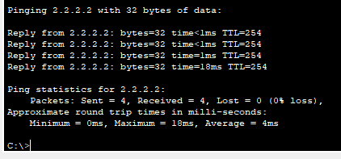

# Project 02 — VLAN + OSPF Lab

## What I built
A small enterprise network simulation in Cisco Packet Tracer. 
Three departments (Sales, IT, HR) each on their own VLAN, all 
routing through a central router. Two branch routers running 
OSPF so routes are shared automatically.

This was my first time actually configuring VLANs and OSPF from 
scratch — not just reading about them for the exam.

## Topology


## How it's connected

```
[R2]----10.0.12.0/30----[R1]----10.0.13.0/30----[R3]
                         |
                       trunk
                         |
                       [SW1]
                      /  |  \
                   PC1  PC2  PC3
                 VLAN10 VLAN20 VLAN30
                 Sales   IT    HR
```

## IP plan

| Device | Interface | IP |
|--------|-----------|-----|
| R1 | Gig0/0 | 10.0.12.1/30 |
| R1 | Gig0/1 | 10.0.13.1/30 |
| R1 | Gig0/2.10 | 192.168.10.1/24 |
| R1 | Gig0/2.20 | 192.168.20.1/24 |
| R1 | Gig0/2.30 | 192.168.30.1/24 |
| R2 | Gig0/0 | 10.0.12.2/30 |
| R2 | Loopback0 | 2.2.2.2/32 |
| R3 | Gig0/0 | 10.0.13.2/30 |
| R3 | Loopback0 | 3.3.3.3/32 |
| PC1 | NIC | 192.168.10.10/24 |
| PC2 | NIC | 192.168.20.10/24 |
| PC3 | NIC | 192.168.30.10/24 |

## What I learned

VLANs were something I understood conceptually for the CCNA but 
configuring them hands-on made it click differently. The fact that 
PC1 and PC2 are on the same physical switch but completely isolated 
until R1 routes between them — that's something you don't fully 
appreciate until you actually build it and watch it work.

The router-on-a-stick setup was interesting. One physical cable 
carrying three VLANs as a trunk, then subinterfaces on R1 handling 
each one. It feels counterintuitive at first but makes total sense 
once you see the subinterfaces come up.

OSPF neighbor formation taking a few seconds to reach FULL state — 
watching that happen in real time was satisfying. R1 automatically 
knew how to reach R2's loopback without me typing a single static route.

## Verification

VLAN config on SW1:


OSPF neighbors in FULL state:


Routing table showing OSPF learned routes:


PC1 pinging across VLANs:


PC1 reaching R2's loopback through OSPF:


## Configs
- [R1](configs/R1-config.txt)
- [R2](configs/R2-config.txt)
- [R3](configs/R3-config.txt)
- [SW1](configs/SW1-config.txt)

## Tools
Cisco Packet Tracer — free, no cloud cost
