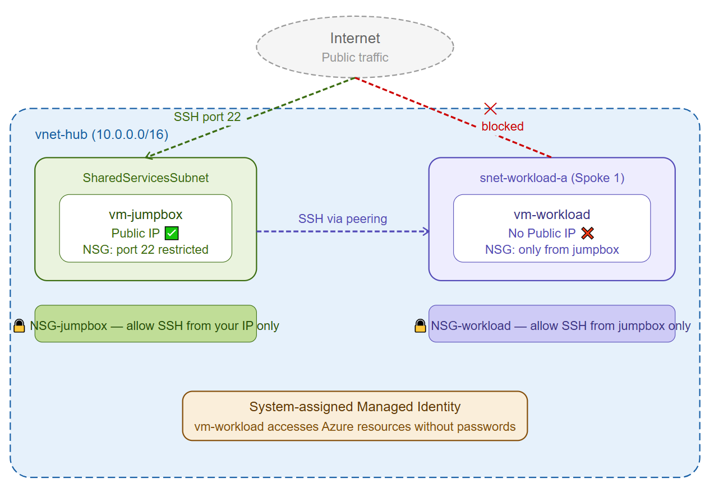
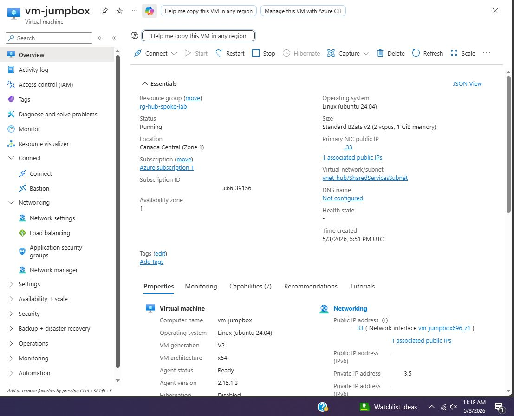
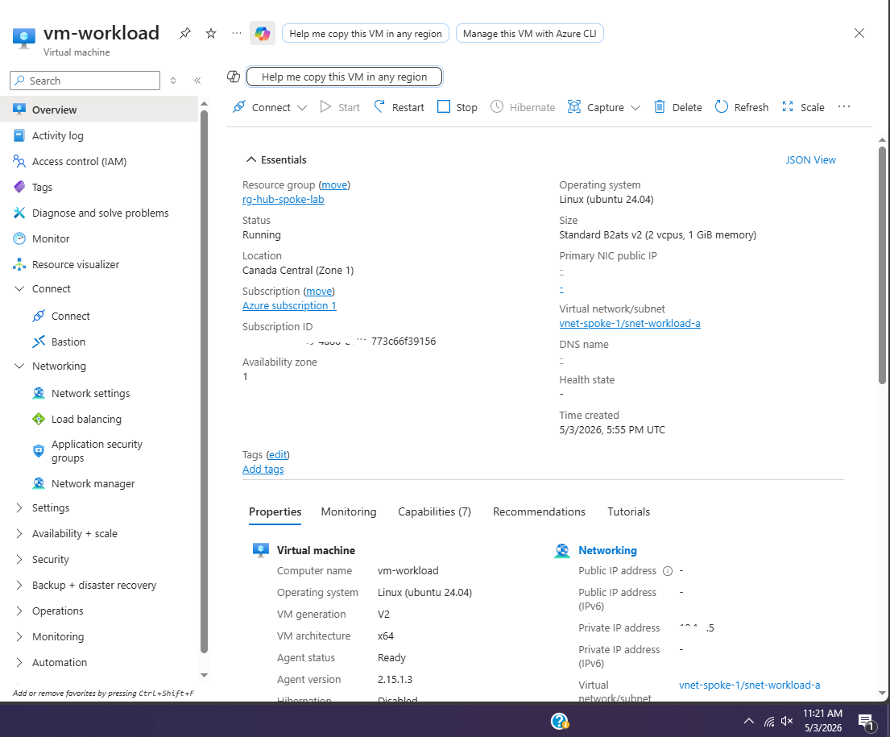
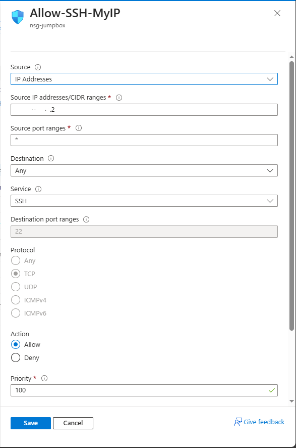
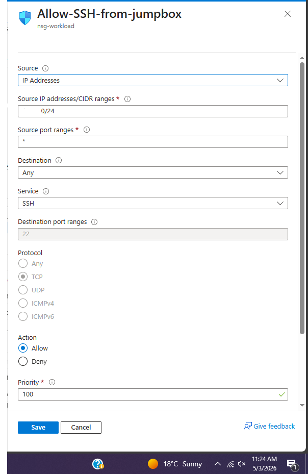
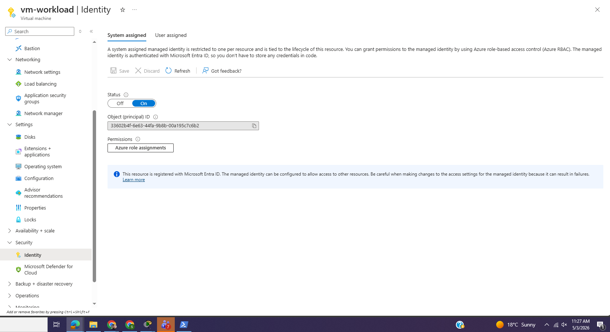
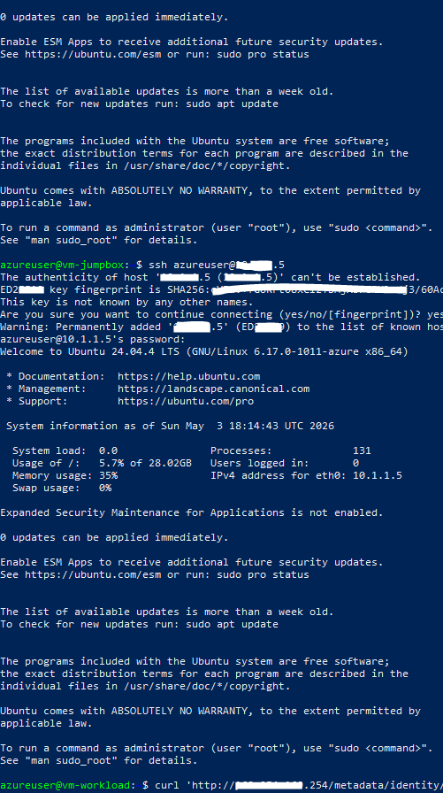
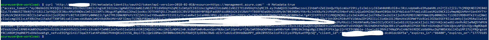

# Project 03 — Secure VM Deployment

## What I built
Two VMs in Azure — a jump box in the hub network with a public IP, 
and a workload VM in Spoke 1 with no public IP at all. The only way 
to reach the workload VM is by going through the jump box first. 
Also attached a managed identity to the workload VM so it can 
authenticate to Azure without storing any passwords.

This is the standard way enterprises secure internal servers — 
nothing critical is ever exposed directly to the internet.

## Architecture


## How access works

```
Your PC
   |
   | SSH (port 22, your IP only)
   |
vm-jumpbox (Public IP, SharedServicesSubnet)
   |
   | SSH (private IP, via VNet peering)
   |
vm-workload (No Public IP, snet-workload-a)
   |
   | Managed Identity
   |
Azure Management API (no passwords needed)
```

## What I configured

**vm-jumpbox**
- Sits in SharedServicesSubnet inside vnet-hub
- Has a public IP so I can SSH in from my machine
- NSG locked down to only allow SSH from my IP address
- Anyone else trying to connect gets blocked

**vm-workload**
- Sits in snet-workload-a inside vnet-spoke-1
- No public IP — completely unreachable from the internet
- NSG only allows SSH from the SharedServicesSubnet range (10.0.3.0/24)
- System-assigned managed identity enabled

**NSG-jumpbox inbound rules**
| Priority | Port | Source | Action |
|----------|------|--------|--------|
| 100 | 22 | My IP /32 | Allow |
| 65000 | Any | VNet | Allow |
| 65500 | Any | Any | Deny |

**NSG-workload inbound rules**
| Priority | Port | Source | Action |
|----------|------|--------|--------|
| 100 | 22 | 10.0.3.0/24 | Allow |
| 65000 | Any | VNet | Allow |
| 65500 | Any | Any | Deny |

## What I learned

Before this I understood NSGs conceptually but hadn't thought through 
the jump box pattern properly. The workload VM having no public IP 
means there's literally no way to reach it from the internet — the 
attack surface is just gone. Even if someone knew the private IP it 
wouldn't matter because there's no route to it from outside.

The managed identity part was eye opening. The VM gets an access token 
from Azure's metadata service at 169.254.169.254 — that's an internal 
Azure endpoint that only VMs can reach. No credentials stored anywhere, 
no secrets to rotate, no risk of a leaked password. Azure handles the 
identity completely.

The NSG troubleshooting was a good real-world lesson too — my home IP 
had changed between when I created the rule and when I tried to connect. 
Had to update the rule with my current IP. In production you'd use a 
more reliable solution like a dedicated VPN or Azure Bastion.

## Verification

Jump box overview — public IP, running:


Workload VM overview — no public IP:


NSG rules on jump box:


NSG rules on workload:


Managed identity enabled on workload VM:


SSH chain — PC into jumpbox, jumpbox into workload:


Managed identity token response from metadata endpoint:


## Results
- ✅ SSH into jumpbox from my machine using public IP
- ✅ SSH from jumpbox into workload using private IP over peering
- ✅ Workload VM completely unreachable from internet directly
- ✅ Managed identity returning valid Bearer token from Azure
- ✅ VM authenticated to Azure Management API with no stored credentials

## Cost
~CA$1 — two B1s VMs running for a couple hours, deallocated after
