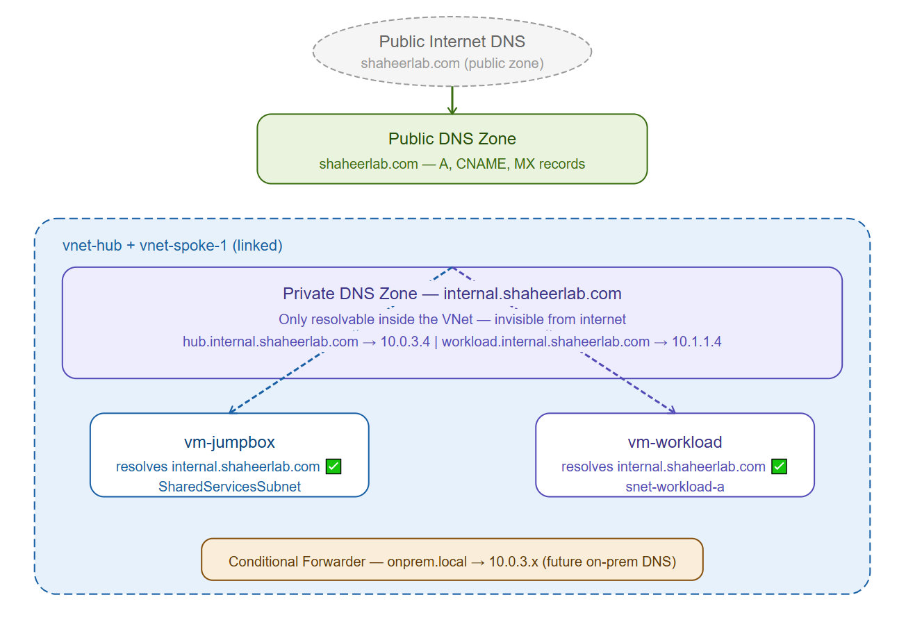
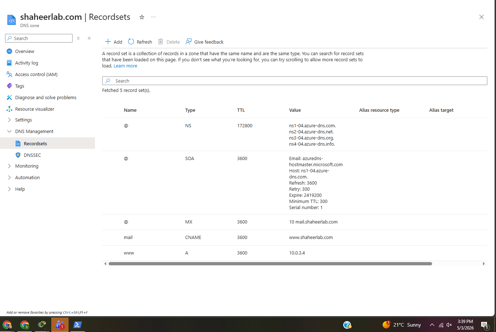
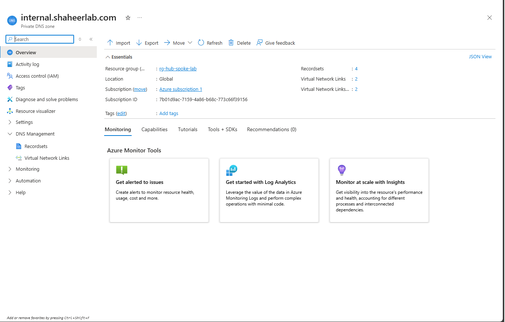
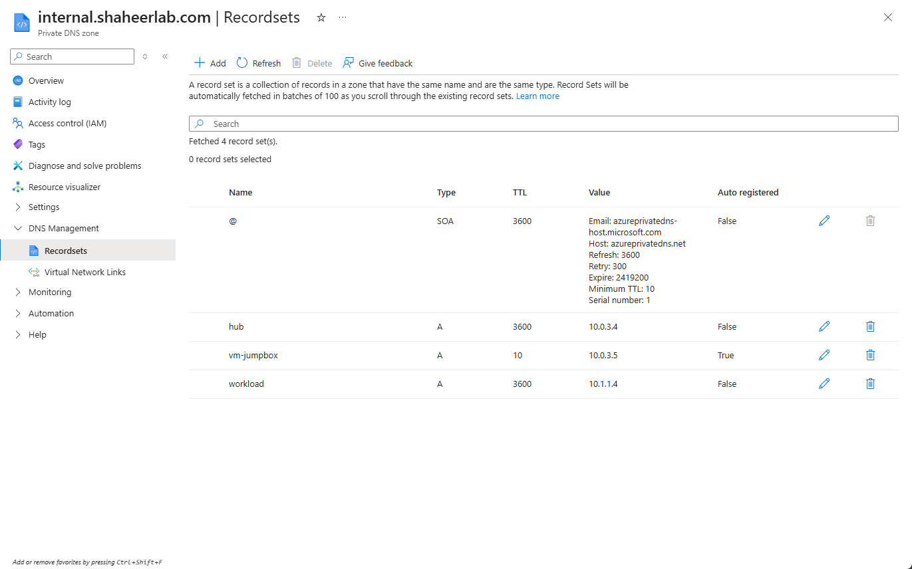
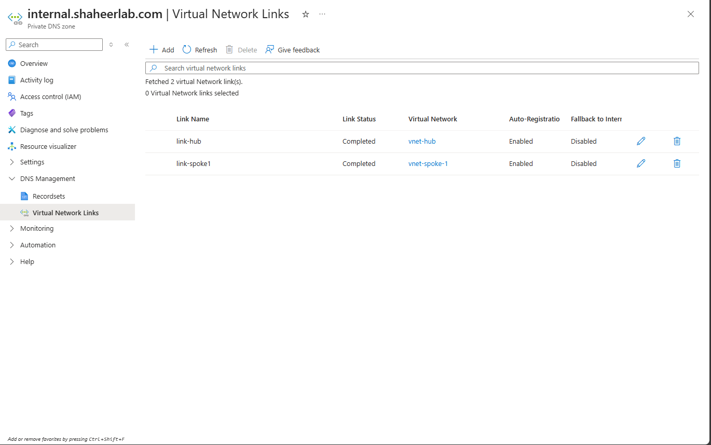
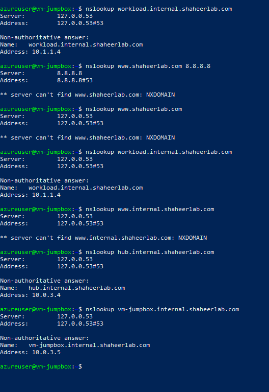

# Project 04 — Azure DNS Lab

## What I built
Set up both public and private DNS zones in Azure. The public zone 
holds standard DNS records for shaheerlab.com. The private zone 
handles internal name resolution inside the VNet — VMs can reach 
each other by hostname instead of memorizing private IPs. Also 
enabled auto-registration so VMs register themselves automatically 
when they join the network.

This is how enterprise environments handle DNS — internal services 
never expose their real IPs, they just use friendly names that only 
resolve inside the private network.

## Architecture


## How it works

```
Internet
   |
Public DNS Zone (shaheerlab.com)
   | A, CNAME, MX records
   | resolves publicly if domain is purchased

Inside VNet (vnet-hub + vnet-spoke-1)
   |
Private DNS Zone (internal.shaheerlab.com)
   | only resolvable inside linked VNets
   | invisible from internet
   |
   ├── hub.internal.shaheerlab.com      → 10.0.3.4
   ├── workload.internal.shaheerlab.com → 10.1.1.4
   └── vm-jumpbox.internal.shaheerlab.com → 10.0.3.5 (auto-registered)
```

## What I configured

**Public DNS Zone — shaheerlab.com**

| Record | Type | Value | Purpose |
|--------|------|-------|---------|
| www | A | 10.0.3.4 | Maps hostname to IP |
| mail | CNAME | www.shaheerlab.com | Alias pointing to www |
| @ | MX | mail.shaheerlab.com | Email delivery |

Note: public resolution requires owning the domain and pointing 
nameservers to Azure. This is a lab so we verified the zone and 
records are correct without purchasing the domain.

**Private DNS Zone — internal.shaheerlab.com**

| Record | Type | Value | How created |
|--------|------|-------|-------------|
| hub | A | 10.0.3.4 | Manual |
| workload | A | 10.1.1.4 | Manual |
| vm-jumpbox | A | 10.0.3.5 | Auto-registered |

**VNet Links**

| Link | VNet | Auto-registration |
|------|------|-------------------|
| link-hub | vnet-hub | Enabled |
| link-spoke1 | vnet-spoke-1 | Enabled |

## What I learned

The difference between public and private DNS zones was something 
I understood theoretically but building both made it concrete. 
Public zones are for anything that needs to be reachable from the 
internet. Private zones are for internal services that should never 
be visible outside — the DNS records literally don't exist from 
outside the VNet.

Auto-registration was the part that surprised me most. I deployed 
vm-jumpbox and it automatically appeared as a DNS record in the 
private zone without me doing anything. In a real environment with 
hundreds of VMs this saves a huge amount of manual work and means 
your DNS is always in sync with what's actually running.

The conditional forwarder setup also clicked into place here. When 
we connect on-premises in Project 9, queries for onprem.local will 
forward to the on-prem DNS server automatically. Both sides will be 
able to resolve each other's names without any manual static entries.

DNS is one of those things where if it breaks, everything breaks. 
Understanding how to build and troubleshoot it properly is one of 
the most valuable sysadmin skills.

## Verification

Public DNS zone records:


Private DNS zone overview:


Private DNS records including auto-registered VM:


VNet links showing Completed status:


nslookup results from inside vm-jumpbox:


## Results
- ✅ Public DNS zone created with A, CNAME and MX records
- ✅ Private DNS zone linked to vnet-hub and vnet-spoke-1
- ✅ workload.internal.shaheerlab.com resolves to 10.1.1.4
- ✅ hub.internal.shaheerlab.com resolves to 10.0.3.4
- ✅ vm-jumpbox auto-registered as vm-jumpbox.internal.shaheerlab.com → 10.0.3.5
- ✅ Conditional forwarder configured for future on-prem DNS (onprem.local)

## Cost
~CA$1 — Private DNS zone at $0.50/zone plus minimal query charges
