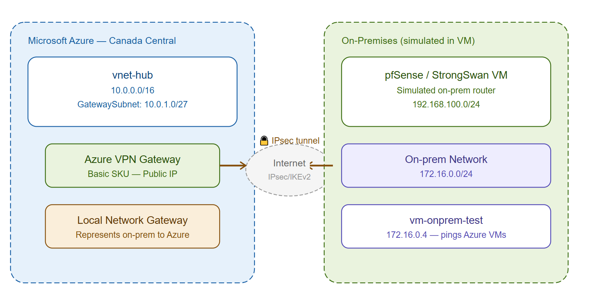
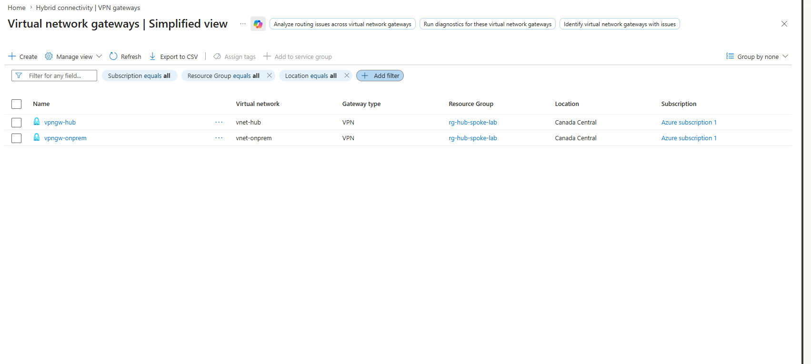
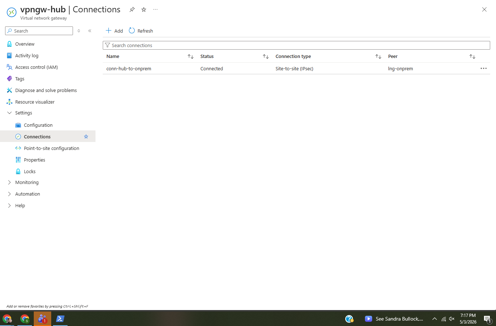
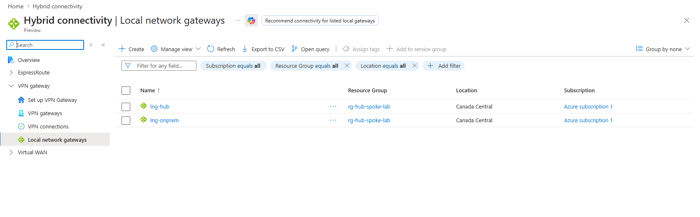
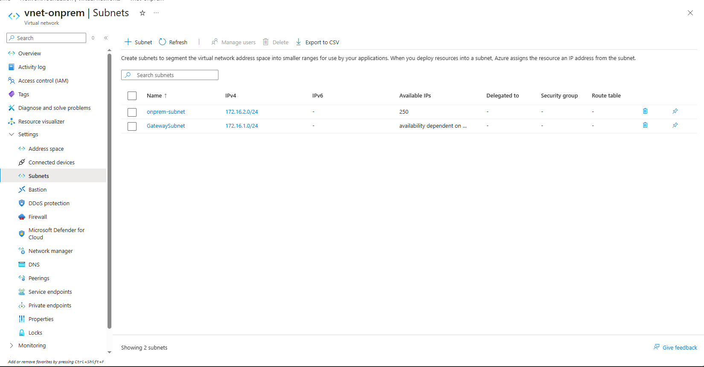
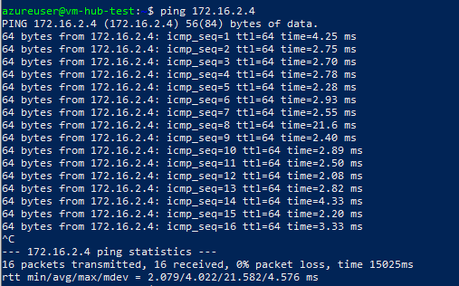
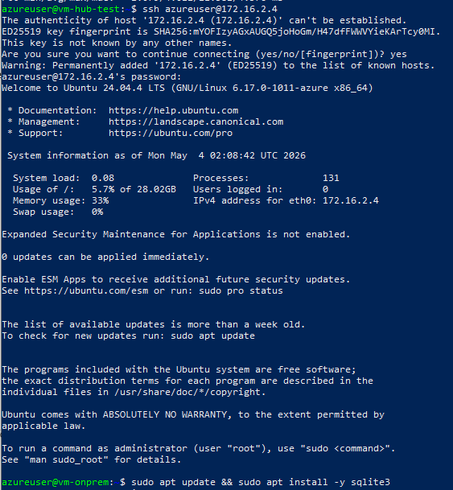

# Project 05 — Site-to-Site VPN

## What I built
A site-to-site IPsec VPN tunnel between Azure and a simulated 
on-premises network. The two networks are completely isolated — 
no peering, no shared infrastructure — and the only way traffic 
flows between them is through the encrypted tunnel.

This is exactly how enterprises connect branch offices or 
on-premises datacenters to Azure. Building it from scratch made 
the whole hybrid cloud concept click in a way that studying for 
AZ-104 didn't fully cover.

## Architecture


## How it works

```
Azure Side                          On-Premises Side
──────────────────────              ──────────────────────
vnet-hub (10.0.0.0/16)             vnet-onprem (172.16.0.0/16)
GatewaySubnet (10.0.1.0/27)        GatewaySubnet (172.16.1.0/27)
vpngw-hub                          vpngw-onprem
pip-vpngw-hub (public IP)          pip-vpngw-onprem (public IP)
        │                                   │
        └──────── IPsec/IKEv2 tunnel ───────┘

vm-hub-test (10.0.3.x)   ←tunnel→   vm-onprem (172.16.2.4)
```

## What I configured

**Azure VPN Gateway**
```
Name:     vpngw-hub
SKU:      Basic
Type:     Route-based
VNet:     vnet-hub
Subnet:   GatewaySubnet (10.0.1.0/27)
```

**On-Prem VPN Gateway**
```
Name:     vpngw-onprem
SKU:      Basic
Type:     Route-based
VNet:     vnet-onprem
Subnet:   GatewaySubnet (172.16.1.0/27)
```

**Local Network Gateways**
| Name | Represents | IP | Address Space |
|------|-----------|-----|---------------|
| lng-onprem | On-prem side | pip-vpngw-onprem | 172.16.0.0/16 |
| lng-hub | Azure side | pip-vpngw-hub | 10.0.0.0/16 |

**VPN Connections**
| Name | From | To | Protocol | PSK |
|------|------|----|----------|-----|
| conn-hub-to-onprem | vpngw-hub | lng-onprem | IKEv2 | shared key |
| conn-onprem-to-hub | vpngw-onprem | lng-hub | IKEv2 | shared key |

## What I learned

The VPN Gateway deployment taking 25-45 minutes was something I 
didn't expect. In production you'd plan for this — gateways aren't 
something you spin up on the fly.

The Local Network Gateway concept was interesting. Each side needs 
to tell Azure "here's what the other network looks like" — it's 
essentially a representation of the remote side. Without it Azure 
doesn't know where to route traffic coming out of the tunnel.

The shared key (PSK) has to match exactly on both sides — one 
character off and the tunnel never establishes. That's IKEv2 
doing its job, making sure both sides agreed on the same secret 
before forming the tunnel.

Watching the connection status flip from Unknown to Connected 
was satisfying. Then the ping going through with 0% packet loss 
proved the tunnel was actually passing traffic, not just showing 
as connected in the portal.

One thing I hit was the public IP quota limit on the free 
subscription — Azure caps basic public IPs at 3. Had to work 
around it by copying binaries through the tunnel instead of 
giving the on-prem VM internet access directly. Real-world 
problem solving.

## Verification

Both gateways deployed:


Tunnel Connected status:


Local Network Gateways:


vnet-onprem subnets:


Ping through tunnel — 0% packet loss:


SSH chain through tunnel:


## Results
- ✅ vnet-onprem created simulating on-premises network
- ✅ VPN Gateways deployed on both Azure and on-prem sides
- ✅ Local Network Gateways configured representing each side
- ✅ IPsec/IKEv2 tunnel established — status Connected
- ✅ Ping from Azure VM to on-prem VM — 16/16 packets, 0% loss
- ✅ SSH from Azure into on-prem VM through encrypted tunnel

## Cost
~CA$8 — two Basic VPN Gateways running for several hours.
Gateways deleted immediately after verification.
Lesson: always delete VPN Gateways the same day.
