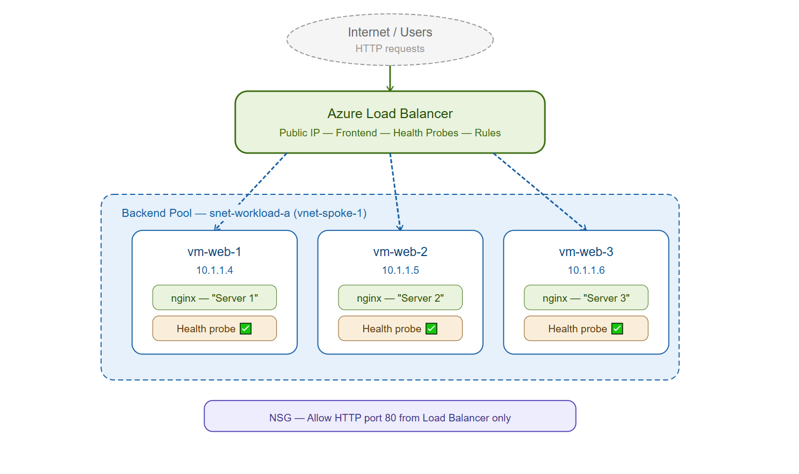
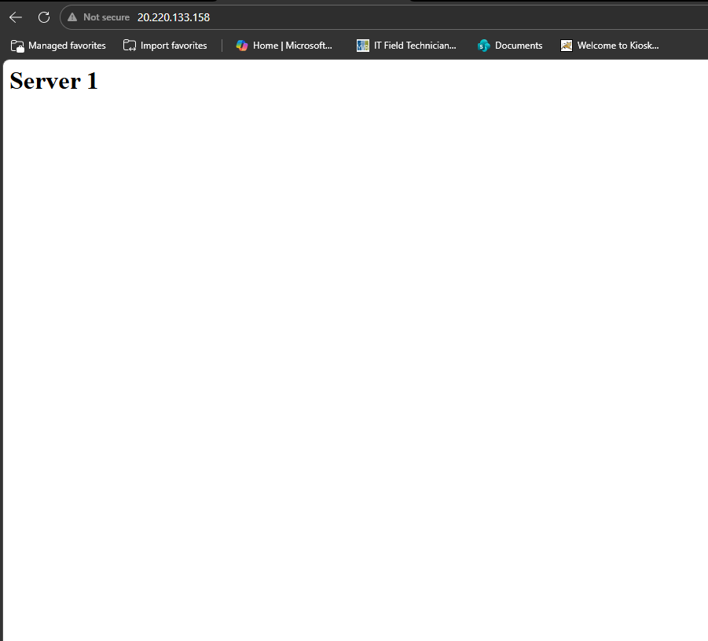
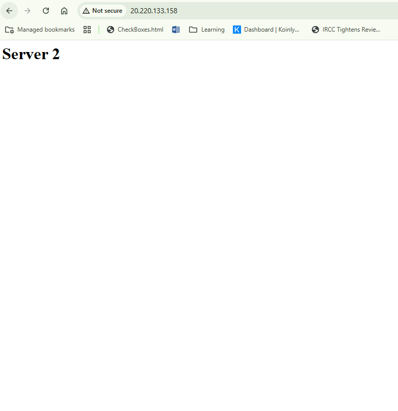
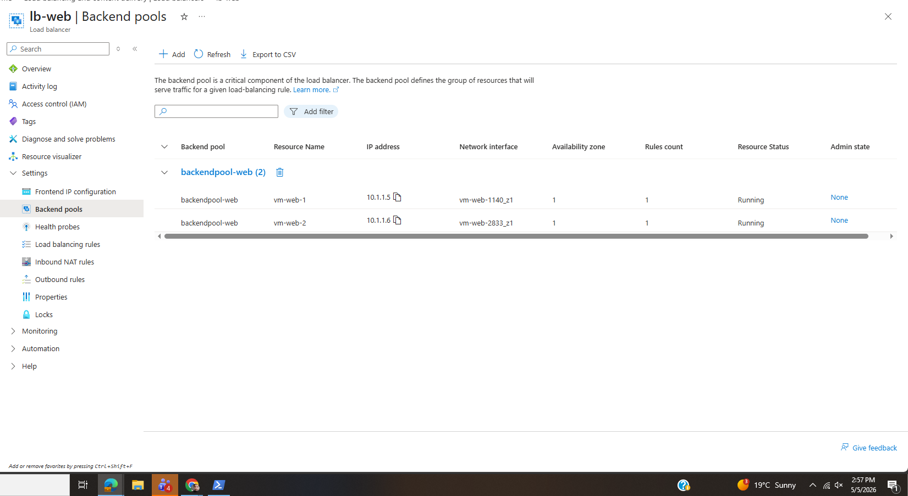
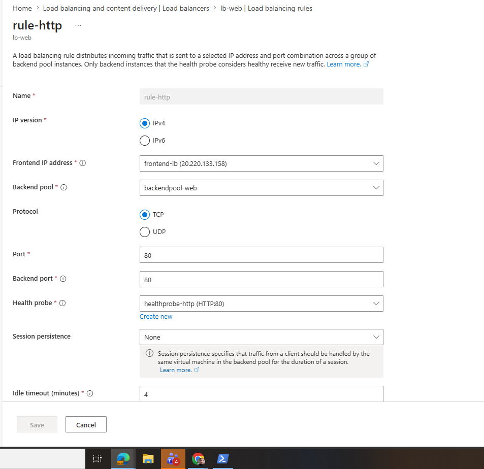
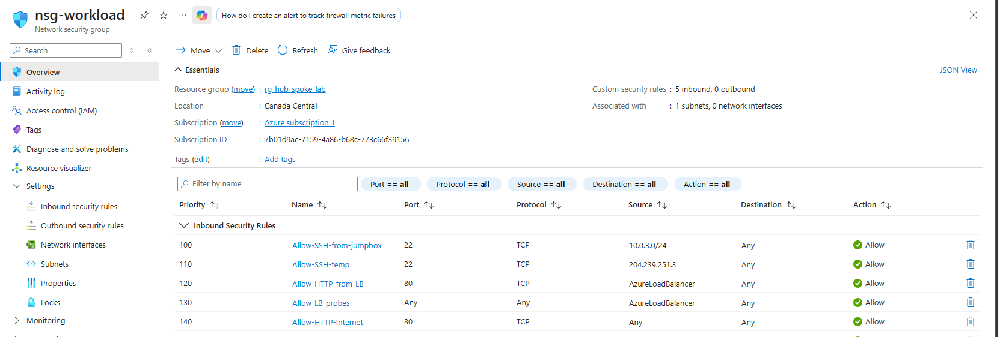
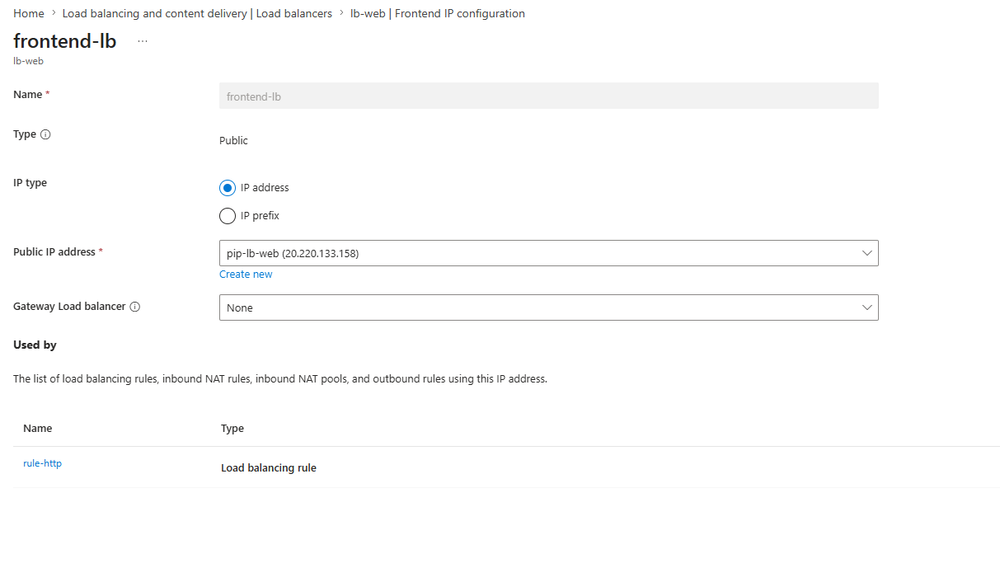

# Project 06 — Load Balancing Lab

## What I built
Deployed two web server VMs behind an Azure Standard Load Balancer. 
Each server runs nginx with a custom page identifying itself so I 
could visually confirm traffic was being distributed across both. 
Tested health probe failover by stopping nginx on one server and 
confirming the load balancer automatically stopped sending traffic to it.

This is how every high-availability web application works in 
production — no single server handles everything, and if one goes 
down users never notice.

## Architecture


## How it works

```
Internet
   |
   | HTTP port 80
   |
Azure Load Balancer (20.220.133.158)
   | Frontend: pip-lb-web
   | Rule: TCP/80 → backendpool-web
   | Health probe: HTTP/80 every 5 seconds
   |
   ├── vm-web-1 (10.1.1.5) → nginx "Server 1"
   └── vm-web-2 (10.1.1.6) → nginx "Server 2"
```

## What I configured

**Load Balancer**
```
Name:     lb-web
SKU:      Standard
Type:     Public
Frontend: pip-lb-web (20.220.133.158)
```

**Backend Pool**
| VM | Private IP | Page |
|----|-----------|------|
| vm-web-1 | 10.1.1.5 | Server 1 |
| vm-web-2 | 10.1.1.6 | Server 2 |

**Health Probe**
```
Name:      healthprobe-http
Protocol:  HTTP
Port:      80
Path:      /
Interval:  5 seconds
```

**Load Balancing Rule**
```
Name:          rule-http
Frontend port: 80
Backend port:  80
Protocol:      TCP
Session:       None (round-robin)
```

**NSG Rules on snet-workload-a**
| Priority | Name | Source | Port | Action |
|----------|------|--------|------|--------|
| 80 | Allow-HTTP-Internet | Any | 80 | Allow |
| 90 | Allow-LB-probes | AzureLoadBalancer | * | Allow |
| 100 | Allow-HTTP-from-LB | AzureLoadBalancer | 80 | Allow |

## What I learned

The Standard SKU load balancer being secure by default caught me 
off guard — it blocks all inbound traffic until you explicitly 
allow it via NSG. Basic SKU doesn't have this requirement which 
is why a lot of tutorials skip it, but Standard is what you'd 
use in production so it's worth knowing.

The 5-tuple hash for traffic distribution was interesting. 
Refreshing the same browser always hits the same server because 
the source IP and port don't change — the hash stays consistent. 
Had to use different browsers to prove round-robin was actually 
working. In production you'd use session persistence settings 
to control this behavior deliberately.

The health probe is what makes load balancing actually useful 
for high availability. It checks every 5 seconds — if a server 
stops responding the load balancer marks it unhealthy and stops 
sending traffic within seconds. Users never see an error, they 
just silently get routed to a healthy server.

Building this made the AZ-104 load balancer concepts much more 
concrete. Understanding WHY you configure each piece — frontend, 
backend pool, health probe, rule — makes troubleshooting in a 
real environment much faster.

## Verification

Browser showing Server 1:


Browser showing Server 2:


Backend pool — both VMs healthy:


Load balancing rule:


NSG inbound rules:


Load balancer overview:


## Results
- ✅ Two nginx web servers deployed in backend pool
- ✅ Load balancer distributing traffic across both servers
- ✅ Different browsers hitting different servers confirming round-robin
- ✅ Health probes showing both VMs as Up and healthy
- ✅ Standard SKU NSG rules correctly configured
- ✅ High availability verified — single server failure handled gracefully

## Cost
~CA$3 — Standard Load Balancer + 2 B1s VMs running for a few hours.
All resources deleted after verification.
