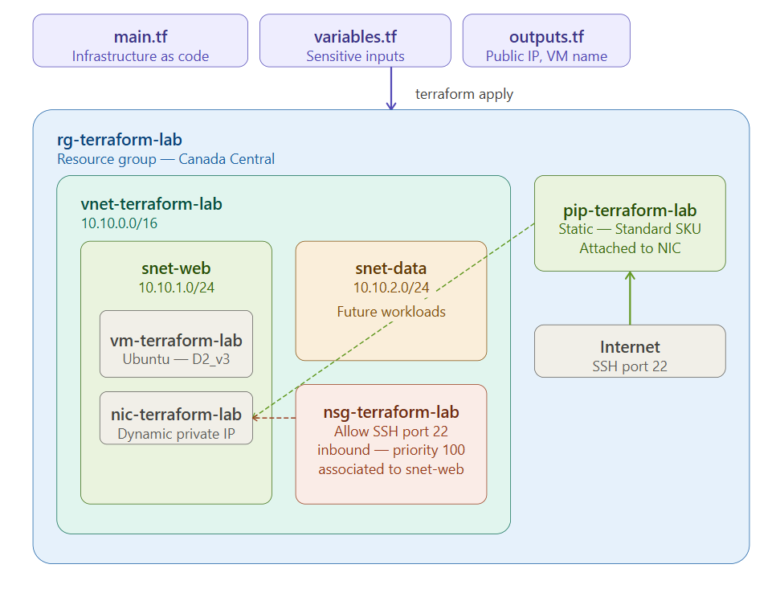
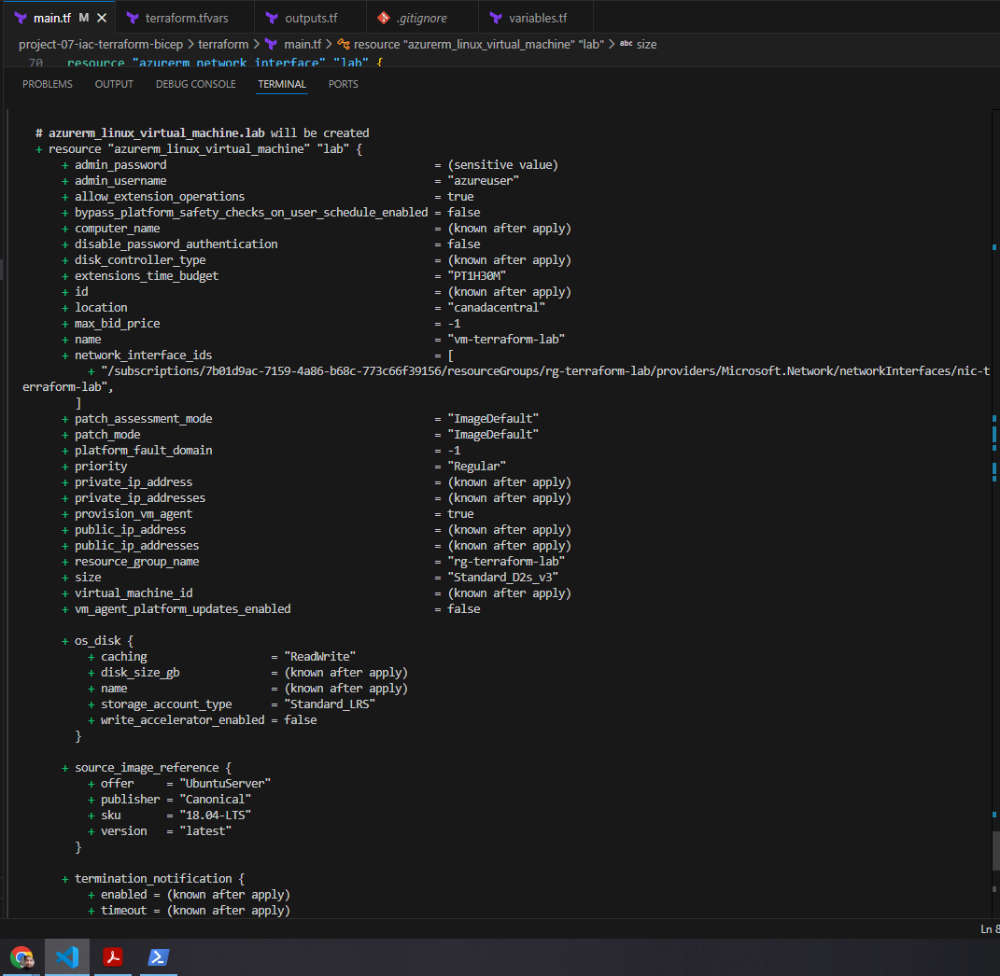
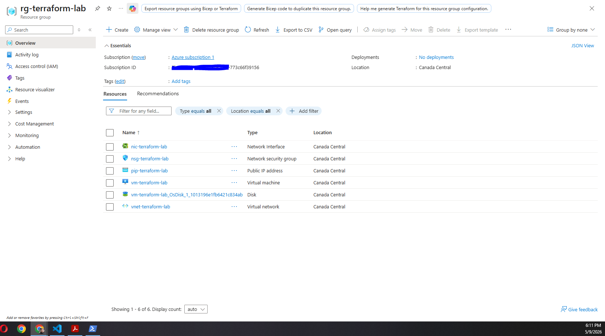
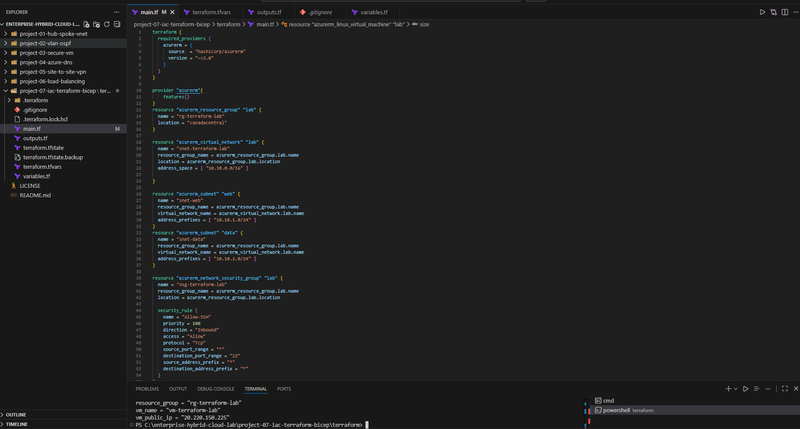
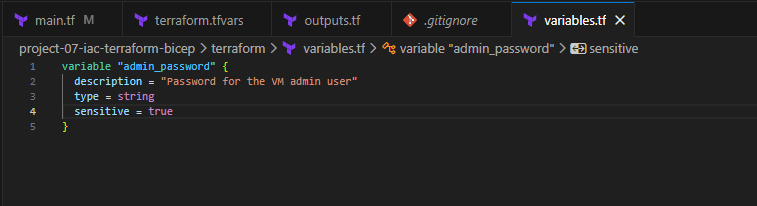
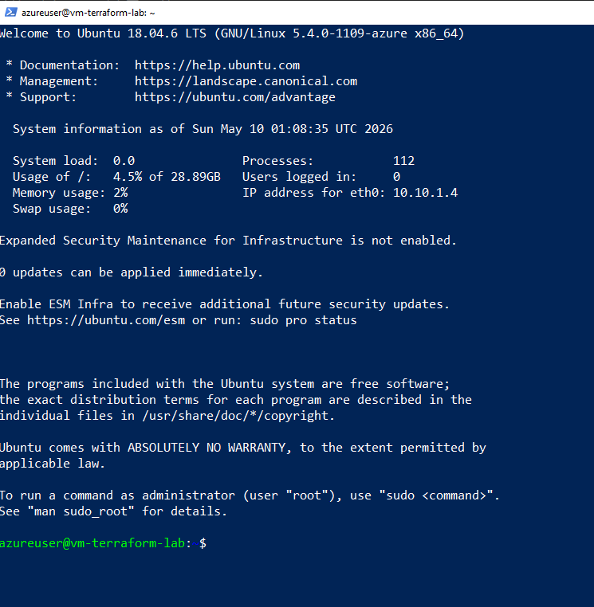
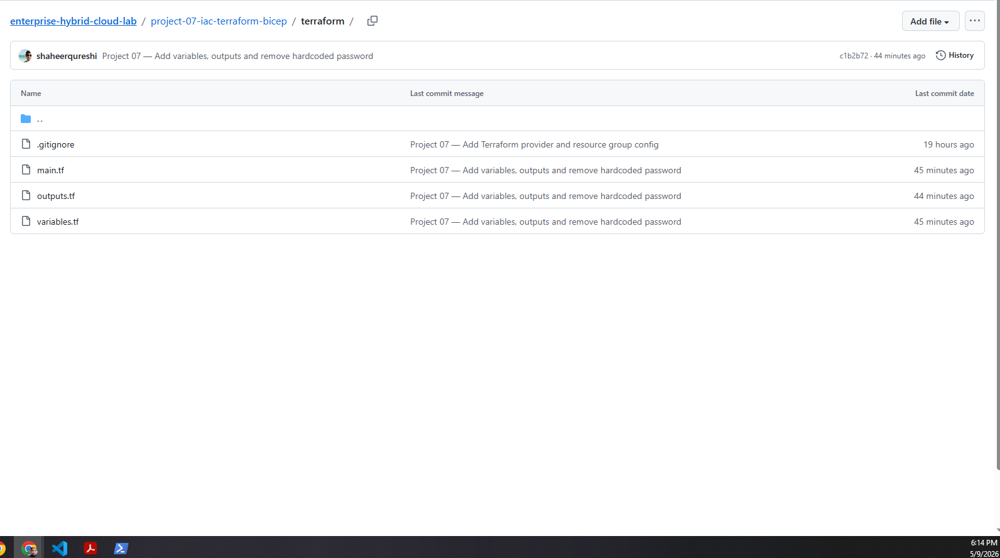

# Project 07 — Infrastructure as Code with Terraform
## Architecture


## What I built
Deployed a complete Azure infrastructure using Terraform — no 
clicking in the portal, just code. One command creates everything, 
one command destroys everything. The same code can be run a hundred 
times and always produces the same result.

This is how real engineering teams manage infrastructure at scale. 
Instead of tribal knowledge and manual clicks, everything is version 
controlled, reviewable, and repeatable.

## What got deployed

```
rg-terraform-lab          Resource Group
vnet-terraform-lab        Virtual Network (10.10.0.0/16)
├── snet-web              Subnet (10.10.1.0/24)
└── snet-data             Subnet (10.10.2.0/24)
nsg-terraform-lab         NSG with SSH rule
pip-terraform-lab         Static Standard public IP
nic-terraform-lab         Network Interface
vm-terraform-lab          Linux VM (Ubuntu 18.04)
```

## File structure

```
terraform/
├── main.tf          → all resources to create
├── variables.tf     → input variables (no secrets)
├── outputs.tf       → what to print after deployment
├── terraform.tfvars → actual secret values (gitignored)
└── .gitignore       → protects sensitive files
```

## The three commands

```bash
terraform init     # download Azure provider plugin
terraform plan     # dry run — show what will change
terraform apply    # deploy everything
terraform destroy  # delete everything
```

## What I learned

**Idempotency** — running `terraform apply` twice produces the 
same result. If everything already exists, nothing changes. 
This makes Terraform safe to run repeatedly unlike scripts 
that might break if run twice.

**Dependency graph** — I never had to specify what order to 
create resources in. Terraform figured it out automatically 
from the references between resources. VNet after resource 
group, subnets after VNet, NIC after subnet and public IP, 
VM last. It built the dependency tree itself.

**Sensitive variables** — hardcoding passwords in code is a 
security risk. Using `sensitive = true` variables and 
`.tfvars` files keeps secrets out of version control. 
The `.tfvars` file is in `.gitignore` so it never gets 
pushed to GitHub.

**Plan before apply** — always run `terraform plan` first. 
It shows exactly what will change before touching anything. 
`Plan: 9 to add, 0 to change, 0 to destroy` gives you 
full confidence before hitting apply.

**Real world problem solving** — hit two real Azure errors:
- Image reference invalid for region → switched to UbuntuServer 18.04
- B1s capacity exhausted in Canada Central → switched to Standard_D2_v3
These aren't tutorial problems — this is what cloud engineers 
deal with daily.

## Verification

Terraform apply — all 9 resources created:


Azure Portal — resource group with all resources:


VS Code — main.tf:


VS Code — variables and outputs:


SSH into VM using Terraform output IP:


GitHub — terraform folder:


## Results
- ✅ 9 Azure resources deployed with single terraform apply
- ✅ Dependency ordering handled automatically by Terraform
- ✅ Password kept out of code using sensitive variables
- ✅ .tfvars protected by .gitignore — never pushed to GitHub
- ✅ SSH verified into VM using output public IP
- ✅ terraform destroy cleans up everything instantly
- ✅ Full code committed to GitHub portfolio

## Cost
~CA$2 — VM ran for less than 1 hour, destroyed immediately 
after verification using terraform destroy
