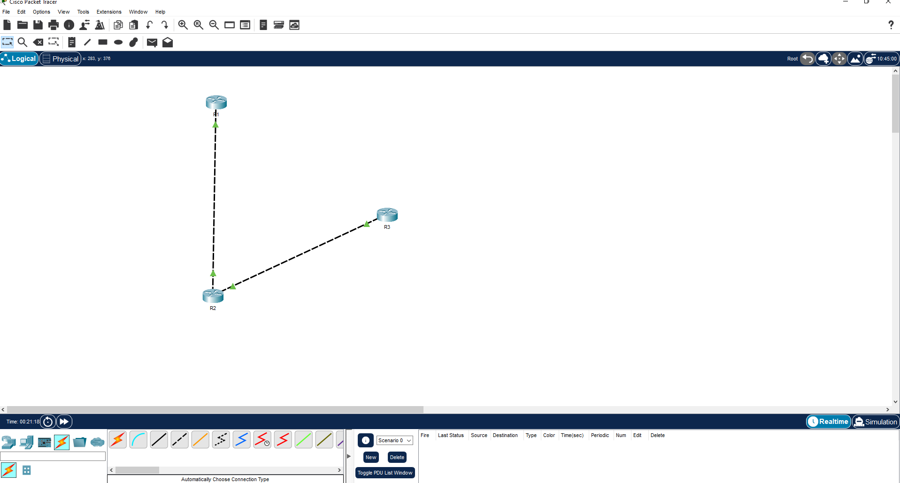
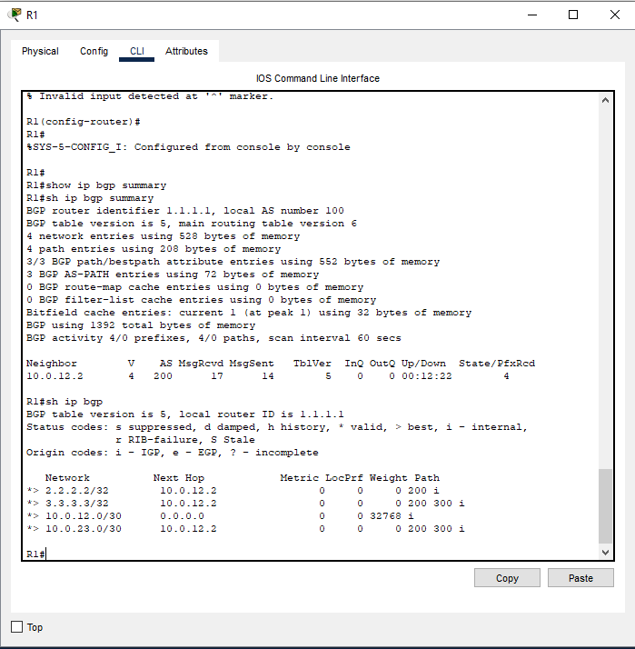
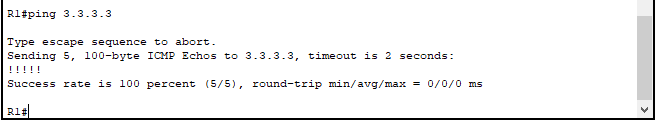
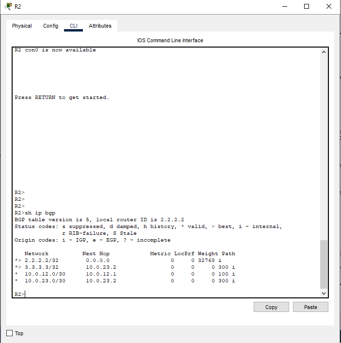

# Project 08 — BGP Lab

## What I built
Simulated a three-AS BGP network in Cisco Packet Tracer. Each router 
belongs to a different Autonomous System — the same model used on the 
real internet where ISPs and large networks exchange routes with each 
other using eBGP.

This was the first lab where I really understood why the internet works 
the way it does. BGP is what glues every network together.

## Topology


## Architecture

```
AS 100                AS 200                AS 300
  R1  ----eBGP----   R2   ----eBGP----   R3
1.1.1.1          2.2.2.2              3.3.3.3

R1 ↔ R2 link:  10.0.12.0/30
R2 ↔ R3 link:  10.0.23.0/30
```

## What I configured

**R1 — AS 100**
```
router bgp 100
 bgp router-id 1.1.1.1
 neighbor 10.0.12.2 remote-as 200
 network 1.1.1.1 mask 255.255.255.255
 network 10.0.12.0 mask 255.255.255.252
```

**R2 — AS 200 (Transit)**
```
router bgp 200
 bgp router-id 2.2.2.2
 neighbor 10.0.12.1 remote-as 100
 neighbor 10.0.23.2 remote-as 300
 network 2.2.2.2 mask 255.255.255.255
```

**R3 — AS 300**
```
router bgp 300
 bgp router-id 3.3.3.3
 neighbor 10.0.23.1 remote-as 200
 network 3.3.3.3 mask 255.255.255.255
 network 10.0.23.0 mask 255.255.255.252
```

## IP Addressing

| Device | Interface | IP | Purpose |
|--------|-----------|----|---------|
| R1 | Gig0/0 | 10.0.12.1/30 | eBGP link to R2 |
| R1 | Loopback0 | 1.1.1.1/32 | Router ID |
| R2 | Gig0/0 | 10.0.12.2/30 | eBGP link to R1 |
| R2 | Gig0/1 | 10.0.23.1/30 | eBGP link to R3 |
| R2 | Loopback0 | 2.2.2.2/32 | Router ID |
| R3 | Gig0/0 | 10.0.23.2/30 | eBGP link to R2 |
| R3 | Loopback0 | 3.3.3.3/32 | Router ID |

## What I learned

**Autonomous Systems** — every organization on the internet has an AS 
number. When two organizations peer with BGP they exchange routes 
between their ASes. R2 acting as transit means it accepts routes from 
AS 100 and passes them to AS 300 and vice versa. That's literally what 
ISPs do.

**eBGP vs iBGP** — eBGP runs between different ASes, iBGP runs within 
the same AS. Packet Tracer only supports eBGP which is actually the 
more important one to understand — it's what connects the internet 
together. iBGP is used internally to distribute external routes.

**AS path** — every BGP route carries a list of ASes it passed through. 
When R1 learns about 3.3.3.3 the AS path shows `200 300` — meaning the 
route came through AS 200 then AS 300. This is how BGP prevents routing 
loops — if a router sees its own AS number in the path it drops the route.

**The ping problem** — BGP knows how to reach a destination but the 
return path has to exist too. When pings were failing it was because R3 
didn't have a route back to R1's source IP. Advertising the link 
networks fixed the return path and pings went to 100% success.

**Route filtering** — in production you never advertise everything to 
everyone. You use prefix-lists and route-maps to control exactly what 
routes get sent to each neighbor. For example an ISP would filter 
customer routes to prevent them advertising someone else's IP space. 
Packet Tracer doesn't support prefix-lists for BGP so this was 
tested conceptually rather than in the simulator.

**Why BGP matters for sysadmins** — even if you never configure BGP 
yourself, understanding it helps you troubleshoot connectivity issues, 
understand why traffic takes certain paths, and communicate with network 
teams when something is wrong.

## Verification

BGP summary — neighbor established, 4 prefixes received:


BGP table — routes with AS paths:


Ping from R1 to R3 loopback — 100% success across 3 ASes:


BGP table on R2 — seeing routes from both AS100 and AS300:


## Results
- ✅ eBGP sessions established between all 3 routers
- ✅ Routes exchanged across AS 100, 200 and 300
- ✅ AS path showing correct hop sequence (200 300)
- ✅ End to end ping from AS100 to AS300 — 5/5 packets
- ✅ R2 acting as transit passing routes between AS100 and AS300
- ✅ Return path fixed by advertising link networks into BGP

## Tools
Cisco Packet Tracer — free, no cloud cost

## Cost
$0 — fully local simulation
