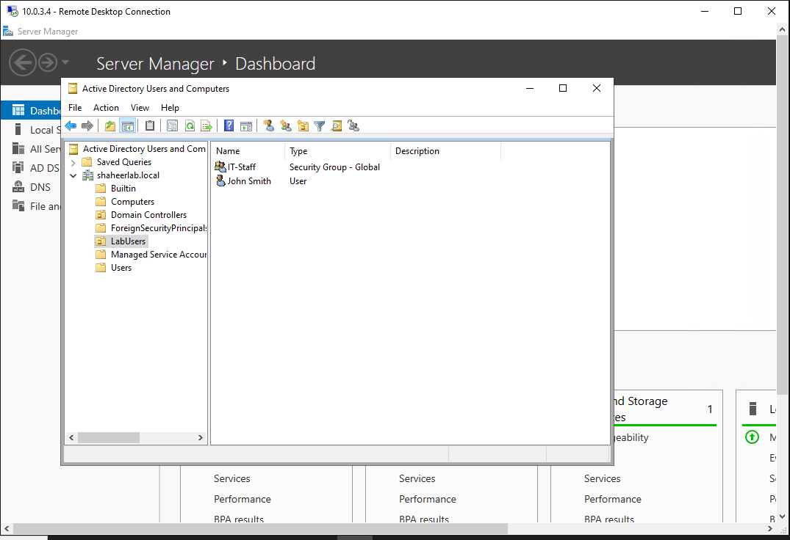

# Project 09 — Full Hybrid Cloud Lab
## Architecture


## Overview

This project simulates a real enterprise hybrid cloud environment — 
an on-premises office network securely connected to Microsoft Azure 
through an encrypted VPN tunnel, with a fully functioning Active 
Directory domain spanning both environments.

Everything in this project mirrors what you find in production 
enterprise environments. The same architecture is used by companies 
connecting branch offices to Azure, managing hybrid identities, and 
running centralized authentication across cloud and on-premises 
infrastructure.

```
┌─────────────────────────────┐         ┌──────────────────────────────────┐
│     On-Premises (Home Lab)  │         │        Microsoft Azure            │
│     Ubuntu VM — VirtualBox  │         │        Canada Central             │
│                             │         │                                   │
│  ┌─────────────────────┐    │         │  ┌────────────────────────────┐  │
│  │   StrongSwan VPN    │    │◄───────►│  │      VPN Gateway           │  │
│  │   IPsec/IKEv2       │    │encrypted│  │      vpngw-hub             │  │
│  └─────────────────────┘    │ tunnel  │  └────────────────────────────┘  │
│                             │         │                                   │
│  ┌─────────────────────┐    │         │  ┌────────────────────────────┐  │
│  │   VM-ONPREM         │    │         │  │   Hub VNet (10.0.0.0/16)   │  │
│  │   Domain joined     │    │         │  │                            │  │
│  │   shaheerlab.local  │    │         │  │  ┌──────────────────────┐  │  │
│  └─────────────────────┘    │         │  │  │ vm-dc (10.0.3.4)     │  │  │
│                             │         │  │  │ Active Directory DS   │  │  │
│  10.10.10.0/24              │         │  │  │ DNS Server           │  │  │
│                             │         │  │  │ shaheerlab.local     │  │  │
└─────────────────────────────┘         │  │  └──────────────────────┘  │  │
                                        │  │                            │  │
                                        │  │  ┌──────────────────────┐  │  │
                                        │  │  │ vm-jumpbox           │  │  │
                                        │  │  │ Secure RDP access    │  │  │
                                        │  │  └──────────────────────┘  │  │
                                        │  └────────────────────────────┘  │
                                        │                                   │
                                        │  ┌────────────────────────────┐  │
                                        │  │ Spoke VNets                │  │
                                        │  │ vnet-spoke-1 (10.1.0.0/16) │  │
                                        │  │ vnet-spoke-2 (10.2.0.0/16) │  │
                                        │  └────────────────────────────┘  │
                                        └──────────────────────────────────┘
```

## What I built

### VPN Connectivity
Established an IPsec/IKEv2 site-to-site VPN tunnel between a local 
Ubuntu VM running StrongSwan and Azure VPN Gateway. Traffic between 
the home network (10.10.10.0/24) and Azure (10.0.0.0/8) flows 
through this encrypted tunnel — exactly how a branch office connects 
to a company's cloud infrastructure.

### Active Directory Domain
Deployed Windows Server 2022 as a domain controller in Azure and 
created a fully functioning Active Directory domain — shaheerlab.local. 
This includes organizational units, user accounts, security groups, 
and DNS integration. The domain controller runs in the hub VNet's 
SharedServicesSubnet making it accessible to all spoke networks and 
the on-premises network through the VPN tunnel.

### Domain Join over VPN
Joined the on-premises Ubuntu VM to the Azure-hosted domain through 
the VPN tunnel. This proves the hybrid identity model works — a 
machine sitting at home can authenticate against a domain controller 
running in Azure as if they were on the same local network.

### DNS Integration
Configured vm-dc as the DNS server for all Azure VNets. DNS forwarder 
set to Azure's internal resolver (168.63.129.16) so internal queries 
resolve via AD DNS and external queries forward to Azure DNS. All four 
VNets updated to use vm-dc as their primary DNS server.

## Infrastructure Details

### Network topology

| Network | Range | Location |
|---------|-------|----------|
| vnet-hub | 10.0.0.0/16 | Azure — shared services |
| vnet-spoke-1 | 10.1.0.0/16 | Azure — workload A |
| vnet-spoke-2 | 10.2.0.0/16 | Azure — workload B |
| onprem-local | 10.10.10.0/24 | Home lab — Ubuntu VM |

### Virtual machines

| VM | OS | IP | Role |
|----|----|----|------|
| vm-dc | Windows Server 2022 | 10.0.3.4 | Domain controller, DNS |
| vm-jumpbox | Windows Server 2022 | 10.0.3.5 | Secure RDP jump box |
| vm-onprem | Ubuntu 24.04 | 10.10.10.1 | Simulated on-prem client |

### Active Directory

| Object | Details |
|--------|---------|
| Domain | shaheerlab.local |
| Forest | shaheerlab.local |
| Domain Controller | vm-dc.shaheerlab.local |
| OU | LabUsers |
| Users | jsmith, domainadmin |
| Groups | IT-Staff, Domain Admins |
| Computer | VM-ONPREM (domain joined) |

### VPN Configuration

| Setting | Value |
|---------|-------|
| Protocol | IPsec/IKEv2 |
| Encryption | AES-256 |
| Authentication | Pre-shared key |
| Azure Gateway SKU | Basic |
| On-prem software | StrongSwan 5.9.x |

## What I learned

**Hybrid identity is complex but powerful.** Getting a Linux machine 
to join a Windows Active Directory domain over a VPN tunnel involves 
Kerberos, LDAP, DNS, GSSAPI, and network routing all working together 
perfectly. When one piece breaks the whole thing fails — which is 
exactly why hybrid environments need skilled engineers who understand 
all the layers.

**Troubleshooting is the real skill.** This project involved 
debugging Kerberos authentication failures, GSSAPI errors, DNS 
resolution issues, and VPN NAT traversal problems. Each error led 
deeper into understanding how enterprise authentication actually 
works under the hood.

**DNS is everything.** Almost every failure came back to DNS. 
The domain controller couldn't be found, Kerberos couldn't resolve 
service principals, the VPN tunnel couldn't reach the right endpoints 
— all DNS. In production environments DNS is the first thing you 
check when anything breaks.

**NAT traversal for IPsec.** Running a VPN from behind a home router 
(double NAT) required enabling forceencaps in StrongSwan to wrap 
IPsec packets in UDP port 4500. This is a real-world problem that 
enterprise engineers deal with when connecting remote sites that sit 
behind NAT devices.

**Time sync matters for Kerberos.** Kerberos requires clocks to be 
within 5 minutes of each other. Clock drift in VMs causes 
authentication failures that look like permission errors. Installed 
chrony on Ubuntu to keep time synchronized.

## Verification

VPN tunnel established — StrongSwan status:


Azure portal — VPN connection showing Connected:


Active Directory — domain tree and users:


Domain join proof — VM-ONPREM in AD:


Bidirectional ping — Ubuntu to vm-dc:


Bidirectional ping — vm-dc to Ubuntu:


DNS configuration:


## Results
- ✅ IPsec/IKEv2 VPN tunnel established — home lab to Azure
- ✅ Bidirectional traffic — 0% packet loss both directions
- ✅ Active Directory domain created — shaheerlab.local
- ✅ Domain controller deployed in Azure hub VNet
- ✅ Users and groups created — jsmith, IT-Staff
- ✅ All VNets using vm-dc as DNS server
- ✅ Ubuntu VM joined to Azure-hosted domain over VPN
- ✅ VM-ONPREM registered in AD computer accounts
- ✅ Kerberos authentication working across VPN tunnel

## Technologies used
- Microsoft Azure — VPN Gateway, Virtual Networks, Windows Server 2022
- Active Directory Domain Services (AD DS)
- StrongSwan — IPsec/IKEv2 VPN
- Kerberos authentication
- LDAP / GSSAPI
- Ubuntu Server 24.04 LTS
- PowerShell — AD administration
- Azure CLI

## Cost
~CA$10 — Windows Server VMs (D2s_v3 + B2s) and VPN Gateway 
running for several hours. VPN Gateway deleted after verification. 
VMs deallocated when not in use.
