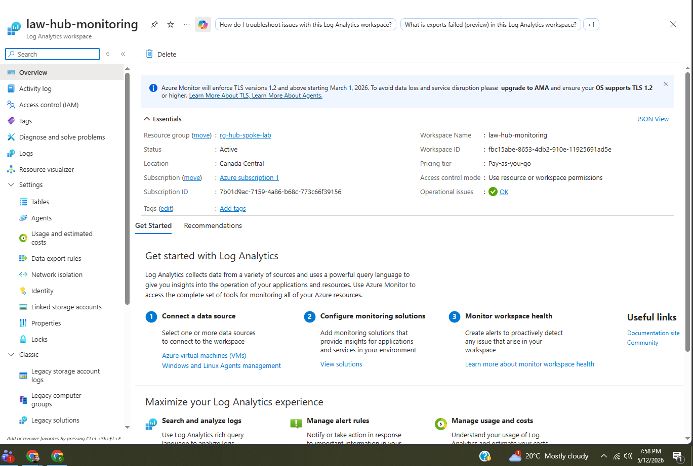
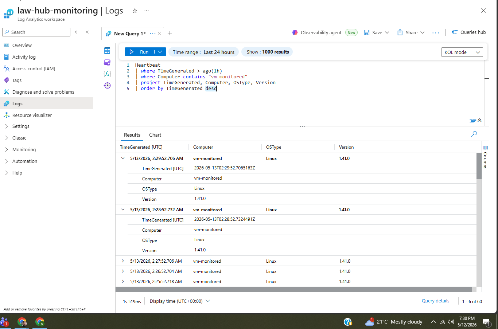
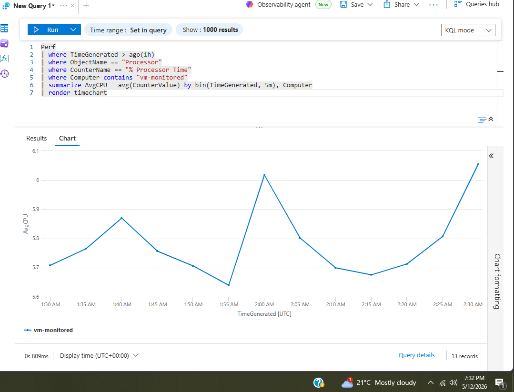
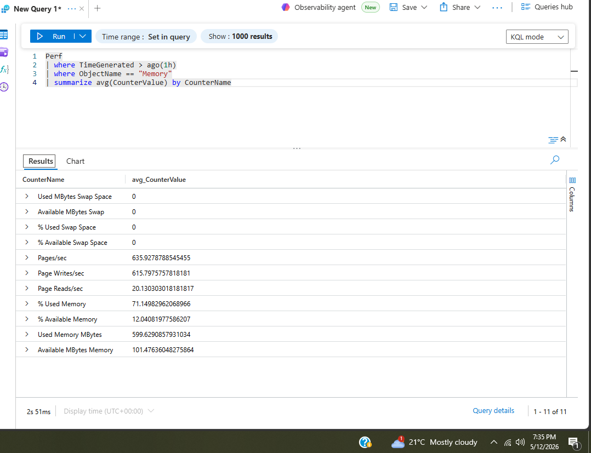
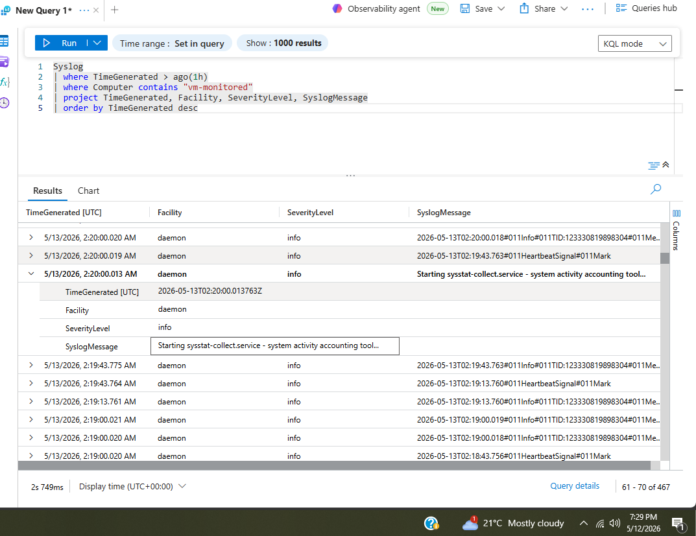
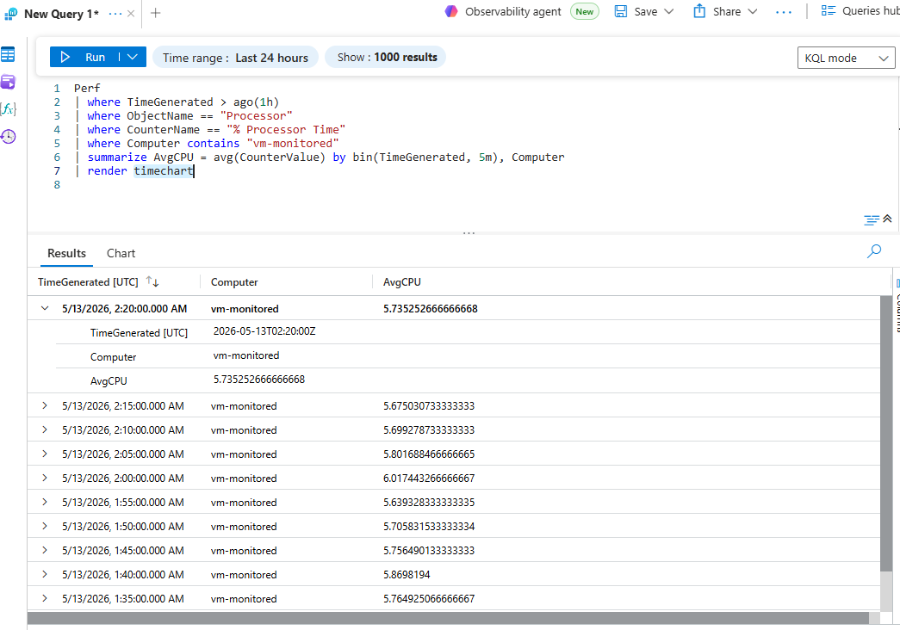
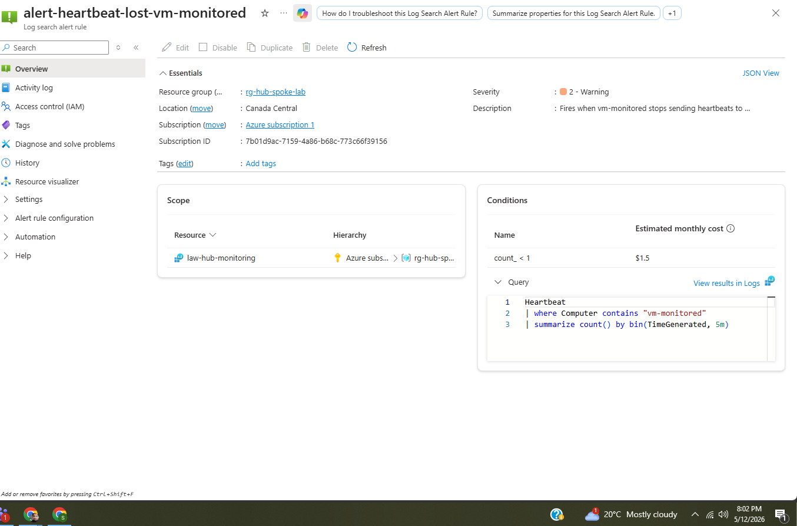

# Project 10 — Network Observability

## What I built
Set up centralized monitoring across the Azure environment using 
Log Analytics, KQL queries, NSG flow logs, and automated alerting. 
Instead of guessing what's happening across the infrastructure, 
everything now feeds into one place where you can query, visualize, 
and get alerted on.

This is how enterprise teams maintain visibility — not waiting for 
users to report problems, but seeing issues before they happen.

## Architecture


## How it works

```
vm-monitored
     │
     │ Azure Monitor Agent (installed via DCR)
     ↓
Log Analytics Workspace (law-hub-monitoring)
     │
     ├── Heartbeat      → is the VM alive?
     ├── Perf           → CPU, memory, disk metrics
     ├── Syslog         → system events and logs
     └── VMProcess      → running processes
     │
     ├── KQL Queries    → ask questions about your data
     ├── Timecharts     → visualize trends over time
     └── Alert rules    → get notified when things go wrong

Network Watcher
     │
     └── NSG Flow Logs  → who talked to who, on what port
         └── Traffic Analytics → visual traffic dashboards
```

## What I configured

**Log Analytics Workspace**
```
Name:     law-hub-monitoring
Region:   Canada Central
Tier:     Pay-as-you-go (free for first 5GB/day)
```

**Data Collection Rule**
```
Name:           dcr-vm-monitoring
VM:             vm-monitored
Data sources:   Linux Syslog (LOG_DEBUG)
                Performance counters (CPU, memory, disk, network)
Destination:    law-hub-monitoring
```

**NSG Flow Logs**
```
NSG:             nsg-jumpbox
Version:         Version 2
Retention:       7 days
Traffic Analytics: Enabled — every 10 minutes
Workspace:       law-hub-monitoring
```

**Alert Rule**
```
Name:       alert-heartbeat-lost-vm-monitored
Query:      Heartbeat | where Computer contains "vm-monitored"
            | summarize count() by bin(TimeGenerated, 5m)
Condition:  count < 1
Frequency:  Every 5 minutes
Severity:   2 — Warning
```

## KQL Queries

KQL (Kusto Query Language) is how you ask questions about your 
data in Log Analytics. Think of it like SQL but for logs and metrics.

**Is the VM alive?**
```kusto
Heartbeat
| where TimeGenerated > ago(1h)
| summarize LastHeartbeat = max(TimeGenerated) by Computer
```

**CPU usage over time:**
```kusto
Perf
| where TimeGenerated > ago(1h)
| where ObjectName == "Processor"
| where CounterName == "% Processor Time"
| where Computer contains "vm-monitored"
| summarize AvgCPU = avg(CounterValue) by bin(TimeGenerated, 5m)
| render timechart
```

**Memory available:**
```kusto
Perf
| where TimeGenerated > ago(1h)
| where ObjectName == "Memory"
| summarize avg(CounterValue) by CounterName
```

**Syslog events:**
```kusto
Syslog
| where TimeGenerated > ago(1h)
| where Computer contains "vm-monitored"
| project TimeGenerated, Facility, SeverityLevel, SyslogMessage
| order by TimeGenerated desc
```

**Top processes by CPU:**
```kusto
VMProcess
| where Computer contains "vm-monitored"
| summarize AvgCPU = avg(CpuUsageMs) by ExecutableName
| top 10 by AvgCPU
| render barchart
```

## What I learned

**Heartbeats are the foundation of monitoring.** Every 60 seconds 
the agent says "I'm still alive." If it goes silent the alert fires. 
That's how you know a server is down before users start calling — 
proactive vs reactive.

**KQL is powerful but readable.** Coming from networking it felt 
intimidating at first but the pipe syntax makes sense — each line 
filters or transforms the data further. Within an hour of writing 
queries it started to feel natural.

**Data Collection Rules replaced the old agent model.** The newer 
DCR approach gives you granular control over exactly what data gets 
collected and where it goes — more efficient and cheaper than 
collecting everything by default.

**DNS was the first thing to break.** When we pointed all VNets to 
the domain controller for DNS in Project 9 and then deleted it, the 
monitoring VM lost internet access and couldn't install packages. 
DNS is always the first thing to check when anything stops working.

**Monitoring costs money if you're not careful.** Log Analytics 
charges per GB ingested beyond the free 5GB/day. In production you'd 
tune exactly what gets collected to avoid unnecessary cost. For this 
lab we used basic performance counters and syslog only.

## Verification

Log Analytics workspace overview:


Heartbeat query — VM confirmed alive:


CPU timechart — performance over time:


Memory query results:


Syslog events from VM:


NSG flow logs configured:


Alert rule created:


## Results
- ✅ Log Analytics workspace deployed and connected to vm-monitored
- ✅ Data Collection Rule sending syslog and performance data
- ✅ Heartbeat confirmed — VM reporting every 60 seconds
- ✅ KQL queries returning CPU, memory, syslog, and process data
- ✅ Timecharts visualizing performance trends
- ✅ NSG flow logs capturing network traffic with Traffic Analytics
- ✅ Alert rule firing when VM heartbeat is lost
- ✅ DNS issue identified and resolved — reinforced importance of DNS

## Cost
~CA$2 — Log Analytics ingestion for a few hours of data,
B2s VM running during lab. VM deleted after verification.
