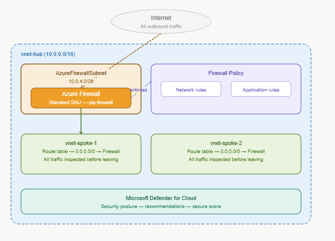
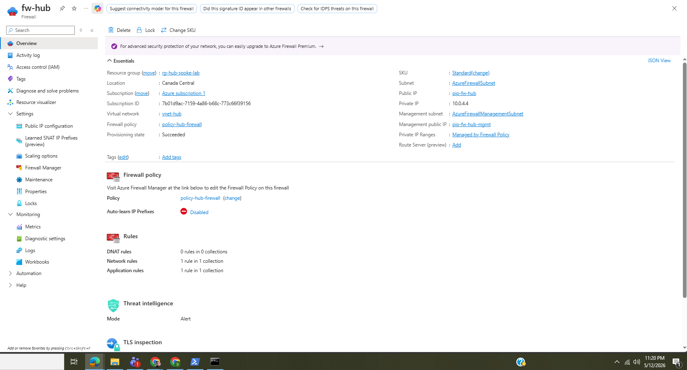
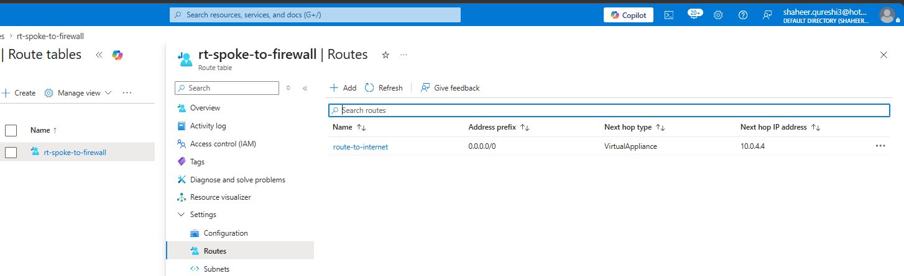
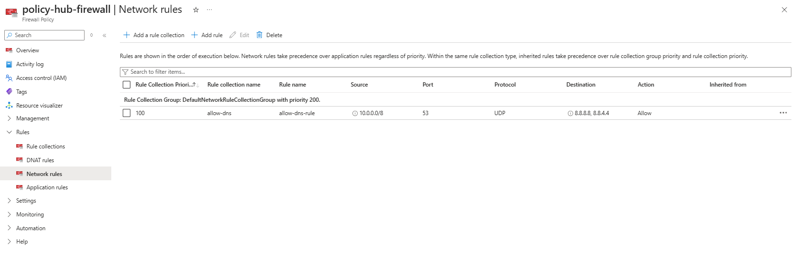
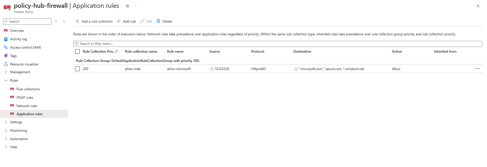
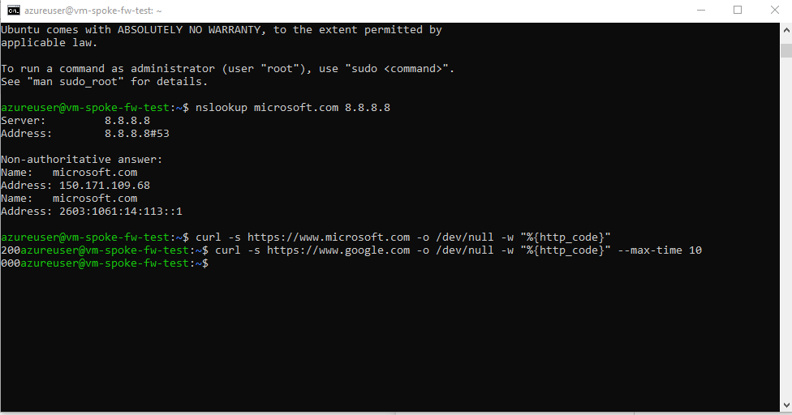
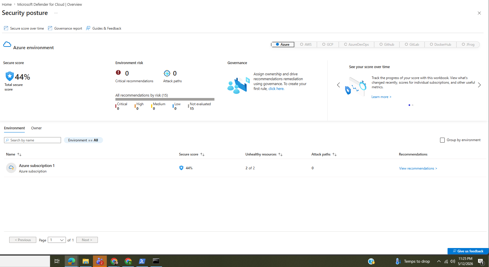

# Project 11 — Azure Firewall + Security

## What I built
Deployed Azure Firewall in the hub VNet and forced all spoke traffic 
through it using route tables. Configured network and application 
firewall rules to allow only specific traffic — DNS and Microsoft 
domains — while blocking everything else by default. Also enabled 
Microsoft Defender for Cloud to assess the security posture of the 
entire Azure environment.

This is how enterprises control outbound traffic at scale. Instead 
of relying on NSGs alone, a centralized firewall gives you one place 
to define what the entire organization can and can't access.

## Architecture


## How it works

```
Spoke VM
   │
   │ All traffic (0.0.0.0/0) routed via route table
   ↓
Azure Firewall (fw-hub — 10.0.4.4)
   │
   ├── Network rules  → allow DNS to 8.8.8.8 port 53
   ├── Application rules → allow *.microsoft.com, *.azure.com
   └── Everything else → DENY (default)
   │
   ↓
Internet (only allowed destinations reach here)
```

## What I configured

**AzureFirewallSubnet**
```
Subnet:  AzureFirewallSubnet
Range:   10.0.4.0/26
VNet:    vnet-hub
```

**Azure Firewall**
```
Name:    fw-hub
SKU:     Standard
Policy:  policy-hub-firewall
VNet:    vnet-hub
```

**Route Table — forced tunneling**
```
Name:        rt-spoke-to-firewall
Route:       0.0.0.0/0 → Virtual Appliance → 10.0.4.4
Associated:  vnet-spoke-1/snet-workload-a
             vnet-spoke-2/snet-workload-b
```

**Firewall Policy — Network rules**
| Name | Source | Destination | Port | Protocol | Action |
|------|--------|-------------|------|----------|--------|
| allow-dns-rule | 10.0.0.0/8 | 8.8.8.8, 8.8.4.4 | 53 | UDP | Allow |

**Firewall Policy — Application rules**
| Name | Source | FQDNs | Protocol | Action |
|------|--------|-------|----------|--------|
| allow-microsoft | 10.0.0.0/8 | *.microsoft.com, *.azure.com, *.windows.net | HTTPS:443 | Allow |

## What I learned

**Default deny is the right posture.** Without a firewall, VMs in 
Azure can reach any destination on the internet. That's a massive 
attack surface. With Azure Firewall in place nothing gets out unless 
explicitly allowed. The principle of least privilege applied at the 
network level.

**Route tables are what make forced tunneling work.** The firewall 
itself doesn't intercept traffic automatically — you have to tell 
Azure to send all traffic through it via a User Defined Route (UDR). 
The 0.0.0.0/0 route pointing to the firewall's private IP is what 
forces every packet through inspection.

**Application rules are more powerful than network rules.** Network 
rules work on IP and port. Application rules work on FQDNs — you can 
allow *.microsoft.com without knowing every Microsoft IP address. 
The firewall does DNS resolution internally to enforce FQDN rules.

**Always check Layer 1 before Layer 7.** Spent time debugging NSGs, 
effective routes, and SSH configuration before realizing the machine 
wasn't connected to the right network. In IT, always verify physical 
and network connectivity before diving into configuration.

**Defender for Cloud gives you a security baseline instantly.** 
Without doing anything, it scanned the entire Azure environment and 
produced a Secure Score with prioritized recommendations. In 
production this is how security teams track their posture over time 
and measure improvement.

## Verification

Firewall overview — running in hub VNet:


Route table — all spoke traffic forced through firewall:


Firewall network rules:


Firewall application rules:


Terminal — DNS works, Microsoft allowed, Google blocked:


Defender for Cloud secure score:


## Results
- ✅ AzureFirewallSubnet and management subnet created in hub VNet
- ✅ Azure Firewall Standard deployed with firewall policy
- ✅ Route table forcing all spoke traffic through firewall
- ✅ DNS rule — port 53 to 8.8.8.8 allowed
- ✅ Application rule — *.microsoft.com allowed (HTTP 200)
- ✅ Google.com blocked — returned 000 (no response)
- ✅ Default deny working — only explicitly allowed traffic passes
- ✅ Defender for Cloud enabled — secure score and recommendations visible

## Cost
~CA$4 — Azure Firewall Standard running for under 2 hours.
Deleted immediately after verification.
Golden rule: treat Azure Firewall like a sprint — build, test, 
document, delete same day.
