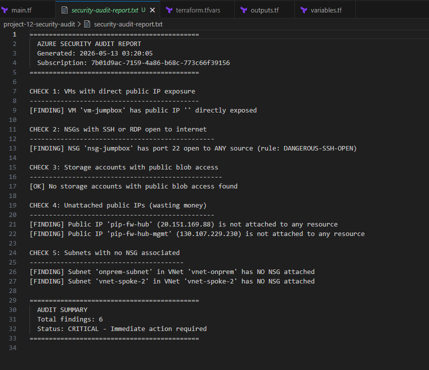

# Project 12 — Security Audit Automation

## What I built
A PowerShell script that automatically scans an Azure environment 
for common security misconfigurations and produces a formatted audit 
report. One command runs the entire audit — no manual portal clicking.

This is exactly what security and cloud teams run on a schedule in 
production. Instead of hoping everything is configured correctly, 
you verify it automatically and get alerted when something drifts.

## Architecture


## What the script checks

| Check | What it looks for | Why it matters |
|-------|------------------|----------------|
| 1 | VMs with public IPs directly exposed | Direct exposure increases attack surface |
| 2 | NSGs with SSH/RDP open to 0.0.0.0/0 | Open admin ports are the #1 cause of breaches |
| 3 | Storage accounts with public blob access | Exposed storage leaks data |
| 4 | Unattached public IPs | Wasting money and leaving unused attack surface |
| 5 | Subnets with no NSG | Unprotected subnets have no traffic control |

## How it works

```
.\azure-security-audit.ps1
         │
         ├── Connect-AzAccount (uses existing session)
         ├── Get-AzVM → check each NIC for public IPs
         ├── Get-AzNetworkSecurityGroup → check each rule
         ├── Get-AzStorageAccount → check blob access
         ├── Get-AzPublicIpAddress → check attachments
         └── Get-AzVirtualNetwork → check subnet NSGs
                    │
                    ↓
         security-audit-report.txt
         (findings + remediation summary)
```

## Demo — three run sequence

**Run 1 — Clean environment:**
All 5 checks passed with zero findings. Confirms the environment 
built throughout the 12 projects is properly secured.

**Run 2 — Introduced misconfiguration:**
Deliberately added a dangerous NSG rule (SSH port 22 open to 
0.0.0.0/0) to simulate a misconfiguration. Script immediately 
caught it along with 5 other real findings — orphaned public IPs 
from the firewall project and unprotected subnets.

**Run 3 — After remediation:**
Removed the dangerous rule and cleaned up orphaned resources. 
Script confirmed environment returned to clean status.

## Script output samples

**Clean run:**
```
Status: CLEAN - No critical issues found
Total findings: 0
```

**Findings run:**
```
[FINDING] NSG 'nsg-jumpbox' has port 22 open to ANY source
[FINDING] Public IP 'pip-fw-hub' is not attached to any resource
[FINDING] Subnet 'onprem-subnet' in VNet 'vnet-onprem' has NO NSG

Status: CRITICAL - Immediate action required
Total findings: 6
```

## What I learned

**Security drift is real.** Even in a carefully built lab environment 
the script found real issues — orphaned public IPs from the firewall 
project and subnets without NSG protection. In production, resources 
get created and deleted constantly and security configurations drift 
over time. Automated auditing catches this.

**PowerShell Az module is powerful.** Every resource in Azure is 
queryable via PowerShell. Get-AzVM, Get-AzNetworkSecurityGroup, 
Get-AzPublicIpAddress — you can build any check you can think of. 
This script covers the basics but could be extended to check 
encryption, backup policies, diagnostic settings, and more.

**Automation beats manual checks every time.** Manually checking 
5 resource types across 4 VNets, 5 NSGs, and multiple subnets 
would take 30 minutes in the portal. The script does it in 2 minutes 
and produces a written report you can share or store for compliance.

**The dangerous rule test proved the script works.** Showing both 
a clean result AND a findings result is more convincing than just 
showing clean. Anyone reviewing this portfolio can see the script 
actually catches real problems.

## Verification

Clean audit — zero findings:


Findings audit — 6 critical issues detected:


After remediation — back to clean:


Script source code:


## Script
[azure-security-audit.ps1](azure-security-audit.ps1)

## Results
- ✅ Script scans 5 security check categories automatically
- ✅ Clean run confirmed environment is properly secured
- ✅ Deliberately introduced misconfiguration caught immediately
- ✅ Script found 5 additional real findings in the environment
- ✅ Remediation confirmed — environment returned to clean status
- ✅ Report saved to text file for documentation and compliance
- ✅ Script committed to GitHub for portfolio and reuse

## Cost
$0 — pure PowerShell scripting, no Azure resources deployed
